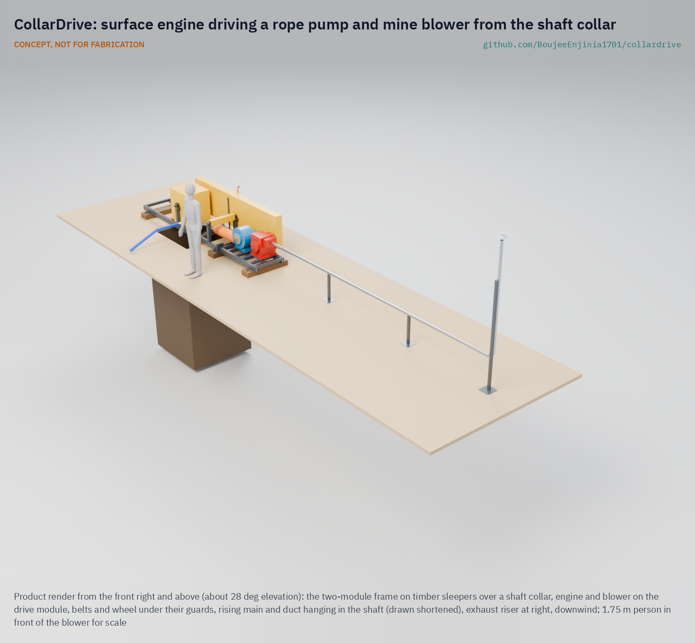
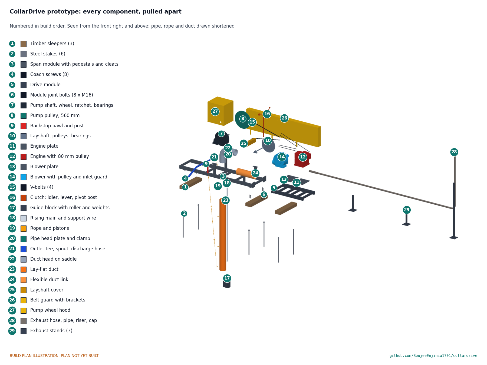

# CollarDrive

     

**Area:** Mining · **TRL:** 3 of 9 (proof of concept on paper) · **Value-engineering target:** $3,500 USD (estimated cost $2,535) · **Difficulty:** 3 of 5

Keeps engines on the surface by driving a rope pump and blower from a frame on the shaft collar.

[Exploded render](media/render-exploded.png) · [Drive detail render](media/render-detail.png) · [Interactive 3D model](media/viewer.html) · [Concept blueprint (PDF)](media/concept-blueprint.pdf) · [General arrangement CLD-DWG-001 (PDF)](cad/drawings/CLD-DWG-001.pdf) · [Sizing note CLD-CAL-001](docs/04-calcs/01-sizing.md) · [Prototype build plan](docs/05-build-plan.md) · [Design decisions](docs/06-design-decisions.md) · [Review note](docs/REVIEW.md)

CONCEPT, NOT FOR FABRICATION. A TRL 3 design on paper: nothing has been built or tested.

## Concept rationale

The simplest way to keep engine fumes out of a shaft is to keep the engine out of the shaft. CollarDrive is a steel frame bolted over the shaft collar that carries one surface engine. The engine belt-drives a rope-and-washer pump, which lifts water up a pipe, and a ventilation blower, which pushes fresh air down a duct. Only the pump rope, the rising main and the air duct go down the shaft.

Keeping it open matters because artisanal miners buy what they can afford locally and adapt it themselves. The rope pump is public-domain technology built in many countries, and small petrol and diesel engines are sold everywhere. An open frame that turns one engine into safe dewatering and fresh air costs little more than the pump miners already buy, and local welders can build it.

## Burning platform

About 45 million people work directly in artisanal and small-scale mining, and the World Bank notes that the sector's historical fatality rate, applied to today's workforce, would mean roughly 30,000 deaths a year ([World Bank, 2021](https://www.worldbank.org/en/news/opinion/2021/10/19/opinion-to-achieve-decent-work-we-must-improve-the-health-and-safety-of-hidden-artisanal-miners)). In Zimbabwe alone, more than a million people work in the sector, in mines where poor ventilation lets toxic gases suffocate miners ([IndustriALL](https://www.industriall-union.org/special-report-campaigning-for-safer-working-conditions-in-zimbabwes-artisanal-and-small-scale)).

Engines underground are a known killer. NIOSH warns that carbon monoxide from small petrol engines can reach fatal levels within minutes, even where ventilation seems good, and that engines should not be run in enclosed or partly enclosed spaces ([NIOSH](https://www.cdc.gov/niosh/topics/co/)). Yet miners keep taking them down: three miners died in Zvimba, Zimbabwe, in October 2024 after running a generator underground to power a jackhammer ([ZBC News, 2024](https://www.zbcnews.co.zw/three-artisanal-miners-die-from-poisonous-gas-in-mapinga/)), and three more died in Kano, Nigeria, in July 2026 when a pump used to drain a flooded pit filled it with fumes ([Channels TV, 2026](https://www.channelstv.com/2026/07/02/toxic-fumes-kill-three-miners-in-kano/)).

## Where it could be used

### By industry

| Industry | Use |
| --- | --- |
| Artisanal and small-scale gold mining | Dewatering and ventilating hand-dug shafts from the surface |
| Artisanal tin, chrome and gemstone mining | Same frame on shallow shafts and pits after rain |
| Hand-dug well construction | Dewatering and fresh air for well diggers working below the water table |
| Small construction and utilities | Shaft and pit dewatering with the engine kept at the surface |
| Mining NGOs and formalisation programmes | A low-cost safety upgrade to bundle with training and licensing |

### By country or region

| Country or region | Why it matters there |
| --- | --- |
| Nigeria | Three miners died in Riruwai, Kano State, in July 2026 when a water pump in a flooded pit released toxic fumes ([Channels TV, 2026](https://www.channelstv.com/2026/07/02/toxic-fumes-kill-three-miners-in-kano/)). |
| Zimbabwe | Three artisanal miners died of carbon monoxide from an underground generator in Zvimba in 2024 ([ZBC News, 2024](https://www.zbcnews.co.zw/three-artisanal-miners-die-from-poisonous-gas-in-mapinga/)), and another died in Mazowe in 2022 after miners sealed a shaft with a generator inside ([ZW News, 2022](https://zwnews.com/illegal-miner-dies-from-fumes-after-sneaking-into-mineshaft-with-a-generator/)). |
| Philippines | Three small-scale miners died after inhaling noxious gases in a gold tunnel in Davao de Oro in 2023; two of them had gone in to rescue the first ([Inquirer, 2023](https://newsinfo.inquirer.net/1741817/3-miners-die-in-alleged-noxious-fume-poisoning-in-davao-de-oro-gold-mining-tunnel)). |
| Global (artisanal mining regions) | About 45 million people work directly in artisanal and small-scale mining worldwide ([World Bank, 2021](https://www.worldbank.org/en/news/opinion/2021/10/19/opinion-to-achieve-decent-work-we-must-improve-the-health-and-safety-of-hidden-artisanal-miners)). |

## What sparked the idea

The idea came from a July 2026 report from Riruwai, in Doguwa Local Government Area of Kano State, Nigeria. Heavy rain had flooded a mining pit overnight, so work stopped. The next day the crew brought in a new pump to drain it, and its fumes killed three miners and left two more unconscious ([Channels TV, 2026](https://www.channelstv.com/2026/07/02/toxic-fumes-kill-three-miners-in-kano/)). The pump did its job; the problem was where the engine was. CollarDrive keeps the engine at the surface and sends only a rope, a pipe and an air duct down the shaft.

## Problem

Artisanal miners lower petrol pumps and generators into flooded or deep shafts, and the exhaust fills the shaft with carbon monoxide. Miners die from the fumes of the machines meant to help them.

Full problem statement: [docs/01-problem.md](docs/01-problem.md)

## Concept

A two-piece steel frame sits on timber sleepers over the shaft collar. One 4.8 kW class petrol engine on the frame drives a layshaft, which turns a rope pump wheel through two V-belts and a ventilation blower through a third; a lever on the belt guard stops the pump while the air keeps running, and a ratchet stops the water column running the rope back. Only the rope, a PVC rising main and a lay-flat air duct go down the shaft. The exhaust leaves through a pipe and a riser more than 6 m downwind.

On paper (CLD-CAL-001) it lifts about 76 L/min from 20 m and 19 L/min from 60 m, and delivers 0.19 m³/s of fresh air at the end of 30 m of duct, using under 0.8 kW of the engine's power. Every requirement is met on paper; the estimated kit cost is $2,535, $965 under the $3,500 value-engineering target.

Full design precis: [docs/02-concept.md](docs/02-concept.md) · Requirements: [docs/03-requirements.md](docs/03-requirements.md)

## Key components

- Two bolted frame modules on three staked timber sleepers, set back from the collar edge
- Engine (4.8 kW class petrol) and centrifugal blower on slotted plates
- Layshaft, V-belts and an idler clutch
- Rope pump wheel with a ratchet backstop, rope and pistons, PVC rising main and guide block
- 200 mm lay-flat air duct with a rigid duct head
- Exhaust pipe and riser on stands, at least 6 m from the collar and the blower intake
- Belt guard, wheel hood, layshaft cover and blower inlet guard
- Personal carbon monoxide and oxygen detector

## Building the prototype

The [prototype build plan](docs/05-build-plan.md) (CLD-BLD-001) shows how to build the first proof-of-concept prototype, component by component, with a making sketch for every made part, a close-up of every joint that needs explaining and a picture for each of the 13 assembly steps. The frame is cut and stick welded from common hollow section, plate and bar, and comes in two pieces that four people can carry to a remote collar; a local machine shop cuts the keyways in the two shafts. Safety stops mark where work halts before lifting over the opening, lowering into the shaft and starting the engine. It is a plan, not yet built.

## Safety

> Published as an open engineering reference, not as certified mine ventilation or pumping equipment. CONCEPT, NOT FOR FABRICATION.
>
> Never run any engine in the shaft. Keep the exhaust riser downwind and at least 6 m (20 ft) from the collar and the blower intake, as NIOSH advises for engines near openings.
>
> Ventilation does not make a shaft safe on its own. Use the gas detector (carbon monoxide and oxygen) before and during work below ground.
>
> Moving machinery: run only with every guard fitted, and stop the engine before touching the belts, the wheel or the rope. The ratchet backstop must be fitted.
>
> The frame covers an open shaft: fence the collar and never stand on the frame over the opening.
>
> Refuel only with the engine stopped and cool, away from the collar.

## Repository layout

| Folder | Contents |
| --- | --- |
| `docs/` | Problem, concept, requirements, calculations and design decisions |
| `cad/src/` | build123d Python source, the source of truth for all geometry |
| `cad/step/`, `cad/stl/` | Exported models for FreeCAD, other CAD tools and printing |
| `cad/drawings/` | 2D sketches and dimensioned drawings |
| `bom/` | Bill of materials |
| `electronics/` | KiCad schematics and PCB layouts |
| `firmware/` | Microcontroller code |
| `media/` | Renders, concept media and the 3D viewer |
| `build-log/` | Dated prototyping notes |

## Documentation

Controlled documents follow the portfolio [documentation standard](.kit/STANDARDS.md). Each carries a document ID (CLD-PRC-001 for the precis), a version and a revision history. Branded PDFs are built with `python .kit/render.py` and attached to GitHub Releases when a document is tagged, for example `CLD-PRC-001/v1.0`.

## Credits

Designed by Amish Chadha at Design Molecule Labs. See [CONTRIBUTORS.md](CONTRIBUTORS.md) for roles. To cite this design, use [CITATION.cff](CITATION.cff) (GitHub shows it as "Cite this repository").

AI assistance (Claude) was used to accelerate prototype documentation and first-pass research. Design direction and all decisions are Amish Chadha's, recorded in this repository's decision records (`docs/decisions/`).

## Licenses

- **Hardware** (CAD, drawings, BOM, electronics): [CERN-OHL-S v2](LICENSE)
- **Software** (firmware, scripts, notebooks): [MIT](LICENSE-SOFTWARE)

A project of the [Design Molecule](https://designmolecule.com) lab.
