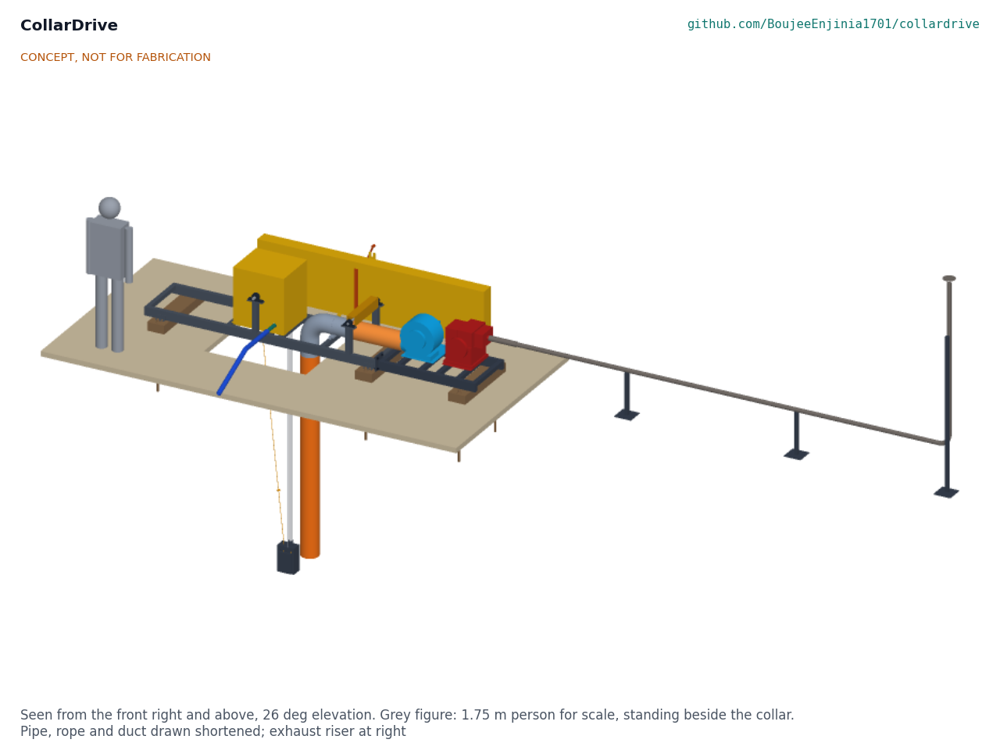
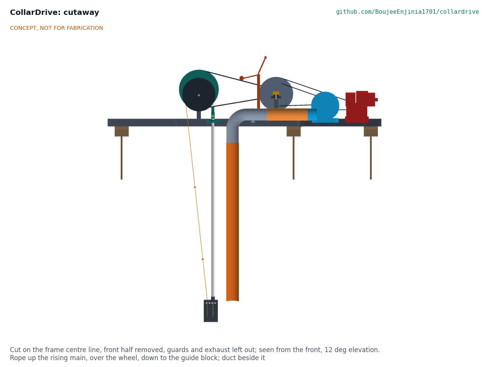
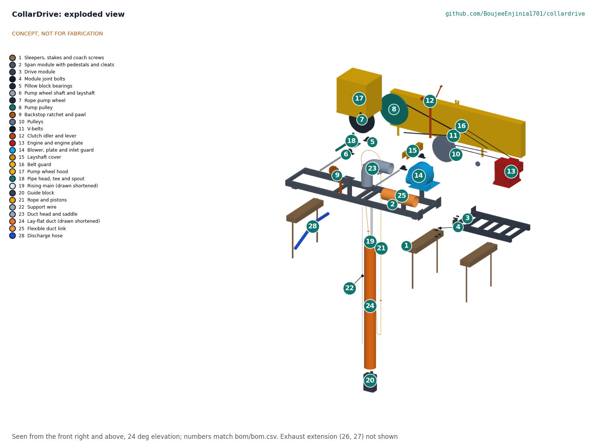
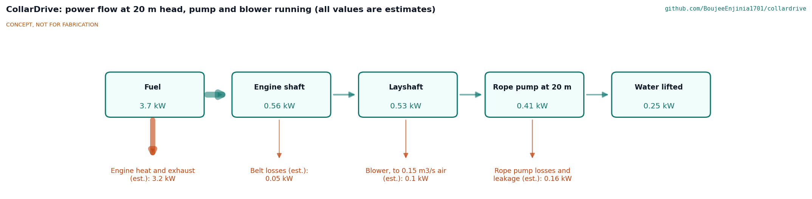

# CollarDrive design precis

Keeps engines on the surface by driving a rope pump and blower from a frame on the shaft collar.

*Figure 1. CollarDrive on its sleepers over a shaft collar, with a 1.75 m person for scale. Pipe, rope and duct drawn shortened.*

## Summary

CollarDrive is a two-piece steel frame that sits on timber sleepers over an artisanal mine shaft. One small petrol engine on the frame drives a layshaft, which turns a rope pump wheel and a ventilation blower through guarded V-belts. Only the rope, the rising main and an air duct go down the shaft; the exhaust leaves through a pipe and a riser more than 6 m downwind. On paper it lifts about 76 L/min from 20 m and 19 L/min from 60 m and delivers 0.19 m³/s of fresh air at the end of 30 m of duct, using under 0.8 kW of the engine's power. The estimated kit cost is USD 2,535 against a USD 3,500 value-engineering target.

## How it works

The engine sits on a slotted plate on the drive module, beyond the shaft opening. Its 80 mm pulley drives a 480 mm pulley on a layshaft at 467 rpm. From the layshaft, two belts turn a 560 mm pulley on the rope pump shaft at 75 rpm, and one belt turns the blower at about 2,000 rpm. The pump wheel's rubber V grips a 6 mm rope carrying a plastic piston every metre. The rope runs down the open side of the shaft to a weighted guide block at the bottom, turns round a roller, and rises through the PVC main, pushing a column of water ahead of the pistons. The water leaves by a tee and a spout at the frame and runs away down a hose. The blower pushes fresh air through a rigid bend and down a 200 mm lay-flat duct to the working level. A lever on the belt guard slackens the pump belts, so air can run without pumping. A ratchet on the pump shaft stops the water column running the rope back when the engine stops. The exhaust goes through a flexible hose and a pipe on stands to a riser 2.4 m high, 7 m from the collar edge.

*Figure 2. Cutaway on the frame centre line: rope up the main, over the wheel and down to the guide block, with the duct beside it.*

## Main components

*Table 1. Components (numbers match bom/bom.csv).*

| BOM | Component | Role |
| --- | --- | --- |
| 1 | Sleepers, stakes and coach screws | Carry the frame on the ground, clear of the collar lip |
| 2 | Span module with pedestals and cleats | Bridges the opening; carries the wheel, the layshaft, the pipe head and the duct head |
| 3, 4 | Drive module and joint bolts | Carries the engine and the blower; bolted to the span module |
| 5, 6 | Pillow blocks and shafts | 30 mm pump shaft and 25 mm layshaft |
| 7, 8, 9 | Rope pump wheel, pump pulley, backstop | Drive the rope; stop it running back |
| 10, 11, 12 | Pulleys, V-belts, clutch idler | Engine to layshaft, layshaft to pump and to blower; pump on and off |
| 13, 14 | Engine and blower on slotted plates | Power and fresh air |
| 15, 16, 17 | Layshaft cover, belt guard, wheel hood | Keep hands and clothing out of moving parts |
| 18 to 22 | Pipe head, rising main, guide block, rope and pistons, support wire | The rope pump in the shaft |
| 23 to 25 | Duct head, lay-flat duct, flexible link | Air from the blower down the shaft |
| 26, 27 | Exhaust extension and stands | Exhaust 6 m or more from the collar and the intake |
| 28, 29 | Discharge hose, gas detector | Water away from the collar; gas check below ground |

*Figure 3. Exploded view with BOM numbers (exhaust extension not shown).*

## Numbers from the TRL 3 calculations

*Table 2. Key results (CLD-CAL-001 v0.2; estimates).*

| Quantity | Value | Tag |
| --- | --- | --- |
| Engine speed, layshaft, rope wheel, blower | 2,800, 467, 75 and 2,007 rpm | A1 |
| Rope speed | 1.57 m/s | A2 |
| Water at 20 m (40 mm main) | 75.7 L/min | B20 |
| Water at 30 m (40 mm main) | 69.8 L/min; pump belts at 92 % of allowable pull | B30 |
| Water at 60 m (25 mm main) | 19.3 L/min | B60 |
| Air at the end of 30 m of duct | 0.189 m³/s, about four people at 0.05 m³/s each | C30 |
| Engine shaft power at 30 m | 0.78 kW, 3.8 times margin on 3.0 kW continuous; 0.58 L/h of petrol | D30 |
| Exhaust outlet from collar edge and intake | 7.05 m and 6.46 m | E1 |
| Frame stress, working and misuse | 27 MPa and 47 MPa (S275) | F2, F3 |
| Ground bearing | About 7 kPa | F4 |
| Heaviest piece | Span module, 69.6 kg | H1 |
| Estimated cost | Value-engineering target: USD 3,500. Estimated cost of the constructable design: USD 2,535 (USD 965 under the target) | H2 |

*Figure 4. Power flow at 20 m head (estimates).*

## Key design choices

All decided by Amish under his pre-approval of 2026-10-03 (CLD-DDR-001 and CLD-DDR-002); see the design decisions register, CLD-DEC-001.

- **One surface engine, one layshaft.** A 4.8 kW class petrol engine governed to 2,800 rpm; a diesel of similar size fits the same plate.
- **Two belts on the pump stage.** One belt would be overloaded at 30 m.
- **Idler clutch.** Air can run alone; nothing to buy.
- **Rope pump sized by depth.** 40 mm main to 30 m, 32 mm to 45 m, 25 mm to 60 m.
- **Forcing ventilation** through 200 mm lay-flat duct, intake at the front of the frame.
- **Exhaust riser downwind**, at least 6 m from the collar and the intake.
- **Two carried modules on set-back sleepers**, nothing bearing on the collar lip.
- **Backstop, full guards and a gas detector** in every kit.

## Patent design-arounds

From the preliminary patent, trademark and prior-art screen (not legal advice):

- The documentation cites rope pump heritage: the public-domain rope and washer pump and the Practica motorised rope pump.
- No patent risk was found in the preliminary screen; the engineering risks noted, pump output at depth and duct pressure loss, are covered in CLD-CAL-001 sections B and C.

## Shared blocks

- Surface power take-off block: the engine plate, layshaft and idler clutch, offered as a shared block for other lab projects that need one engine to drive two machines.
- FieldNode sensor core: a possible carbon monoxide and oxygen monitor at the shaft bottom, later.
- CalRig proof-load: a frame proof test at TRL 4.

## Safety

> **Safety:** CollarDrive is published as an open engineering reference, not as certified mine ventilation or pumping equipment.
>
> - Never run any engine in the shaft. Keep the exhaust riser downwind and at least 6 m from the collar and the blower intake (NIOSH advises at least 6 m (20 ft) from openings).
> - Ventilation does not make a shaft safe on its own. Use the gas detector (carbon monoxide and oxygen) before and during work below ground.
> - Moving machinery: belts, pulleys, shafts, the wheel and the rope can catch hands, hair and clothing. Run only with every guard fitted; stop the engine before touching the drive or the rope.
> - The ratchet backstop must be fitted: without it the water column can run the rope and wheel backwards when the engine stops.
> - The frame covers an open shaft. Fence the collar and never stand or kneel on the frame over the opening.
> - Hot exhaust parts: the hose and pipe near the engine burn; keep them guarded by distance and do not touch them until cool.
> - Refuel only with the engine stopped and cool, away from the collar.
>
> This design is published as an open engineering reference. It is not certified equipment.

## Open questions

None for TRL 3. Every decision is recorded in the design decisions register (CLD-DEC-001); facts that can only be settled with real parts are listed there under "To confirm when parts are bought".
