# CollarDrive prototype build plan

**Plan, not yet built.** How to build the first proof-of-concept prototype, component by component. Building and testing to it is TRL 4 work. Decisions are kept in the design decisions register ([docs/06-design-decisions.md](06-design-decisions.md)), not here.

## 1. What you are building

*Figure 1. Every component pulled apart and numbered in build order.*

The prototype is a steel frame that sits on three timber sleepers over a hand-dug shaft, with one petrol engine on it driving a rope pump and a ventilation blower through V-belts. Figure 1 shows the 29 groups of parts in the order you make or fit them. The frame comes in two pieces that four people can carry: a span module that bridges the opening and carries the pump wheel, the layshaft, the pipe head and the duct head, and a drive module that carries the engine and the blower; they bolt together at a joint. Down the shaft go only a PVC rising main with a rope and pistons inside it, a weighted guide block at the bottom, and a lay-flat air duct. The exhaust leaves through a pipe on stands to a riser more than 6 m away. The work is sawing, drilling and stick welding steel hollow section, plate and bar; folding and welding sheet for the guards; cutting tyre rubber for the wheel; having a machine shop cut keyways in two shafts; and fitting bought parts (engine, blower, bearings, pulleys, belts, pipe, duct, rope, hoses, gas detector). The parts cost about USD 2,535 from the bill of materials, USD 965 under the USD 3,500 value-engineering target.

> **Safety:** CollarDrive works beside an open shaft with a running engine, belts, shafts and a moving rope. The build involves stick welding, grinding galvanised steel (zinc fume), lifts of up to 70 kg by four people, and work at the edge of an open drop. Nobody stands on the frame over the opening, ever. The collar is fenced before work starts. The engine is not started until the safety stops in section 6 allow it, and never with a guard off. Nothing in this plan authorises anyone to go down the shaft; that needs the gas detector and the site's own rules.

## 2. What changed to make it buildable

The concept showed what CollarDrive does; many of its parts were outlines that could not be made or fitted as drawn. Each change keeps what the machine does and is recorded in decision record CLD-DDR-002, decided by Amish under his pre-approval of 2026-10-03.

*Table 1. Changes from the concept.*

| Component | The concept had | The buildable design has | Why |
| --- | --- | --- | --- |
| Frame | One welded frame about 3.9 m long, over 100 kg | A 2.75 m span module and a 1.15 m drive module bolted at a joint with eight M16 bolts (Figures 4, 8 and 9) | Each piece can be carried to a remote collar |
| Ground support | Frame staked over the collar, bearing on it | Three timber sleepers, their edges at least 0.35 m back from the collar edge, staked; cleats and coach screws hold the sills down (Figure 2) | Nothing loads the crumbling collar lip; the frame cannot walk under belt pull |
| Pump belt | One belt | Two matched A belts on two-groove pulleys (Figure 16) | One belt would be overloaded at 30 m |
| Clutch | Not defined | An idler on the slack strand of the pump belts, worked by a lever through the guard (Figure 22) | Nothing to buy; air runs alone with the lever down |
| Bearings | Shafts floating at their heights | Pillow blocks on welded pedestals (Figure 6) | The shafts sit at set heights |
| Backstop | None | Ratchet on the pump shaft and a sprung pawl (Figure 14) | The water column runs the rope back when the engine stops |
| Pump wheel | A disc | Hub, web and two tyre sidewalls forming a rubber V (Figure 11) | The open rope pump wheel, buildable anywhere |
| Pipe head and guide block | Pipe "hung down the shaft" | Pipe head plate with a clamp, outlet tee and rope exit; guide block with roller and weights, hung on a support wire (Figures 24 and 27) | The PVC does not carry the guide block |
| Duct head | Not drawn | Rigid bend on a saddle and strap, flexible link to the blower (Figure 29) | The lay-flat duct needs a rigid turn and a fixed point |
| Engine and blower | Sitting on the frame | Slotted plates on crossbars placed under them (Figure 18) | Slots tension the belts |
| Guards | "Belt and pulley guards" | Belt guard, layshaft cover, wheel hood, blower inlet mesh (Figures 20, 30 to 32) | Every moving part enclosed |
| Exhaust | "Extension downwind" | Hose, pipe on stands, riser 2.4 m high with a rain cap, 7.8 m from the shaft centre (Figure 34) | Outlet at least 6 m from the collar and the intake |
| Water outlet | Not drawn | Spout to the front and a 10 m discharge hose | Water laid away from the collar |

## 3. Making the components

Make and check each component before the assembly step that needs it. Sizes are in millimetres. "Front" is the side of the frame where the spout and the blower intake are; "back" is the belt side. "Pump end" is the end beyond the opening, "drive end" the engine end. Workshop tolerance is 1 mm unless a step says otherwise. Weld with 2.5 or 3.2 mm E6013 electrodes; unless stated, fillets are 4 mm on 3 mm hollow section and 6 mm on plate. Paint every steel part with primer and a top coat after welding, the guards yellow. Mark every part with its name in paint marker as you make it.

### 3.1 Timber sleepers (buy 3, drill)

**What to buy.** Three hardwood or treated timber sleepers, 200 x 100 x 900 mm.

**What to do to them.** Drill a 28 mm hole right through each sleeper on its centre line, 400 mm each side of the middle, for the stakes.

**How they fit the parts next to them.**

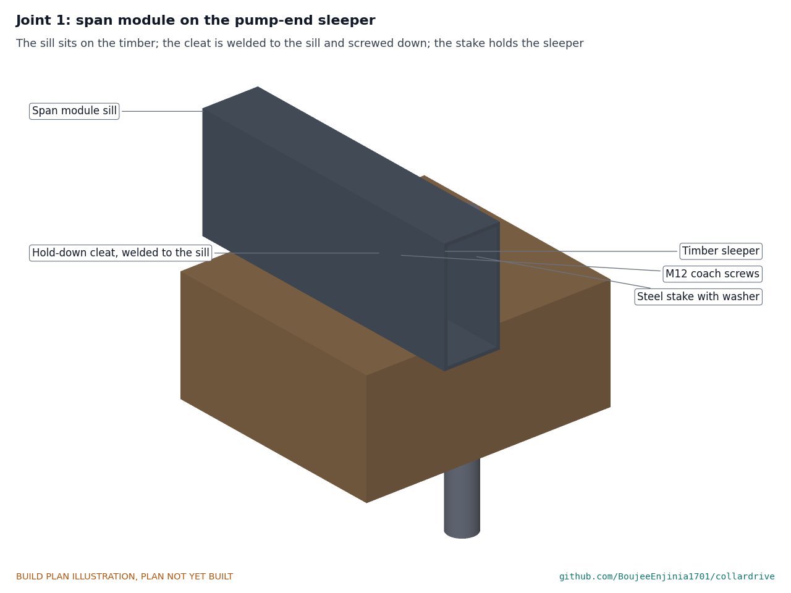

*Figure 2. Joint 1. The sill sits on the timber; a cleat welded to the sill is screwed down with two M12 coach screws; a stake through the sleeper holds it in the ground.*

**Check before moving on.** Each sleeper lies flat on a level patch without rocking.

### 3.2 Steel stakes (make 6)

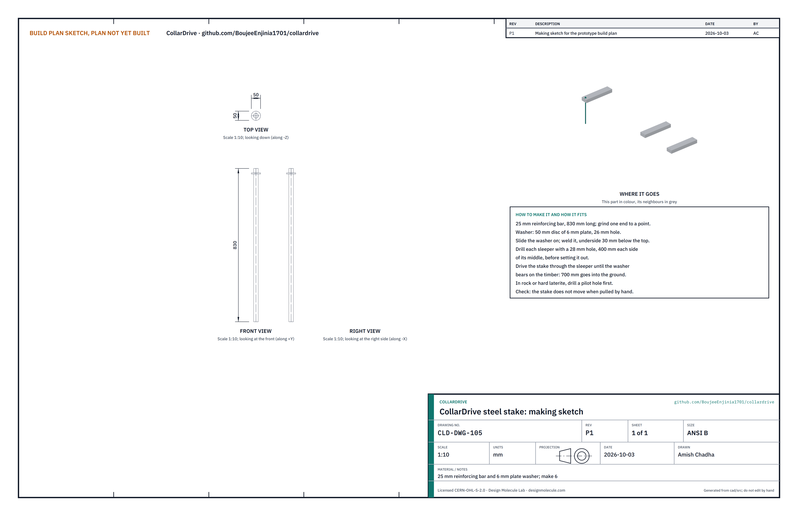

*Figure 3. Steel stake making sketch (CLD-DWG-105).*

**What it is and what it is made from.** Six stakes pin the sleepers to the ground. 25 mm reinforcing bar, 830 mm long each; a 50 mm washer of 6 mm plate.

**How to make it.**

1. Saw the bar to 830 mm; grind one end to a point.
2. Cut a 50 mm disc of 6 mm plate and drill it 26 mm.
3. Slide the washer on and weld it all round with its underside 30 mm below the top.

**How it fits the parts next to it.** The stake goes down through the sleeper's 28 mm hole until the washer bears on the timber; 700 mm goes into the ground (Figure 2).

**Check before moving on.** The washer is square to the bar; the bar is straight within 3 mm.

### 3.3 Span module

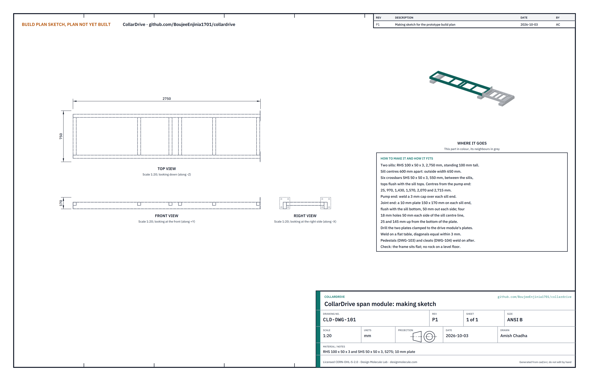

*Figure 4. Span module making sketch (CLD-DWG-101).*

**What it is and what it is made from.** The longer frame module, which bridges the shaft opening. Two sills of RHS 100 x 50 x 3, six crossbars of SHS 50 x 50 x 3, two joint plates of 10 mm plate and two 3 mm end caps, all S275. With its pedestals and cleats it weighs about 70 kg.

**How to make it.**

1. Saw two sills to 2,750 mm with square ends. Stand them 100 mm tall on a flat table with their centres 600 mm apart (outside width 650 mm).
2. Saw six crossbars to 550 mm. Fit them between the sills, tops flush with the sill tops, at centres 25, 970, 1,430, 1,570, 2,070 and 2,715 mm from the pump end.
3. Check the diagonals are equal within 3 mm, then weld every crossbar all round.
4. Weld a 3 mm cap over each sill end at the pump end.
5. Cut two joint plates 150 x 170 mm from 10 mm plate. Clamp each to the matching plate for the drive module (section 3.6) and drill four 18 mm holes through both together: 50 mm each side of the plate's middle, 25 and 145 mm up from its bottom edge. Mark the pairs.
6. Weld one plate over each sill end at the drive end, flush with the sill bottom and centred across the sill, so it stands 70 mm above the sill top and 50 mm out each side.

**How it fits the parts next to it.** The sills sit on the pump-end and joint sleepers. The pedestals, the cleats, the pawl post, the pipe head plate, the duct saddle, the idler post and the guard brackets all fix to it (sections 3.4 to 3.21). The joint plates bolt face to face with the drive module's (Figure 9).

**Check before moving on.** On a level floor the module sits flat on all four corners; the sill tops are straight within 2 mm.

### 3.4 Bearing pedestals (make 4)

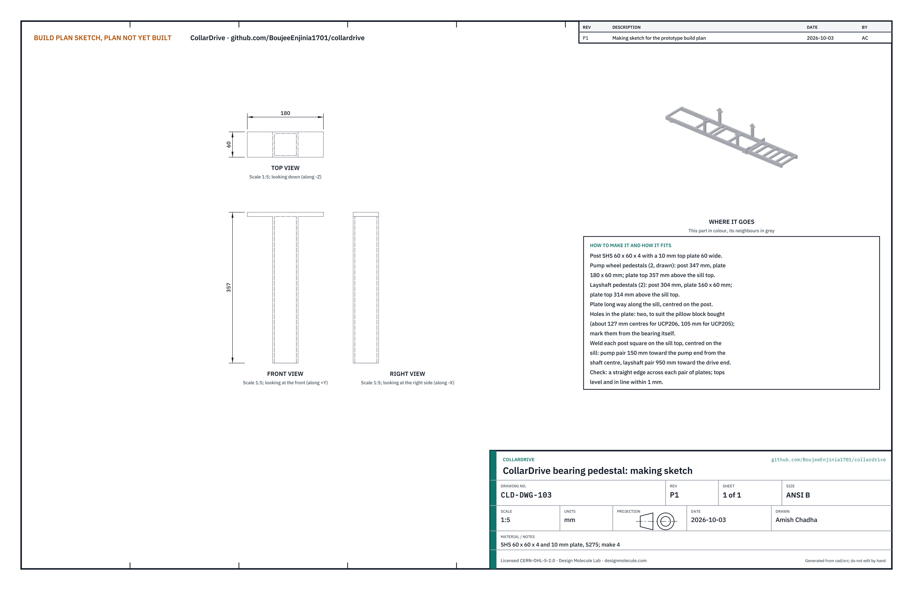

*Figure 5. Bearing pedestal making sketch (CLD-DWG-103).*

**What it is and what it is made from.** Four short posts that lift the pillow blocks to the shaft heights: two for the pump wheel shaft, two for the layshaft. SHS 60 x 60 x 4 and 10 mm plate, S275.

**How to make it.**

1. Pump pair: saw two posts 347 mm long and cut two top plates 180 x 60 mm. Layshaft pair: two posts 304 mm and two plates 160 x 60 mm.
2. Set each pillow block on its plate and mark its two bolt holes from the block itself (about 127 mm centres for the UCP206, 105 mm for the UCP205); drill to suit the bolts, usually 14 or 17 mm.
3. Weld each plate on top of its post, long way along the frame, centred.
4. Weld the posts square on the sill tops, centred across the sills: the pump pair 150 mm toward the pump end from the shaft centre line, the layshaft pair 950 mm toward the drive end.

**How it fits the parts next to it.**

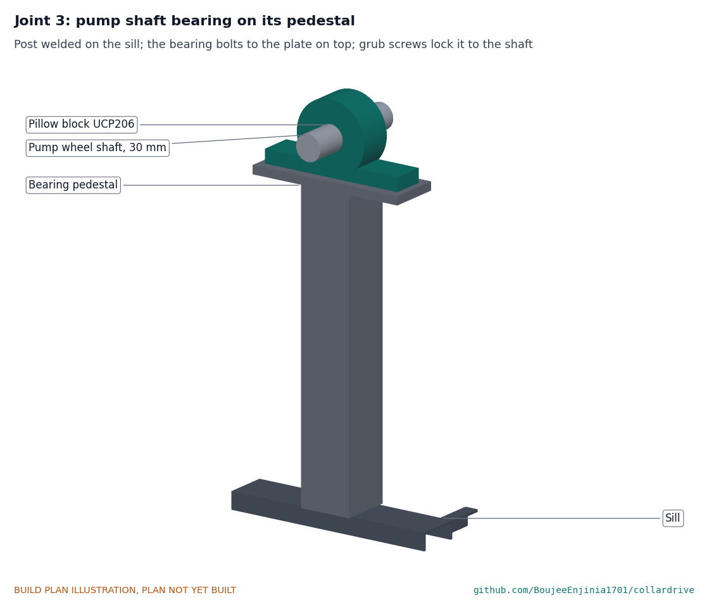

*Figure 6. Joint 3. The post is welded on the sill; the pillow block bolts to the plate; its grub screws lock it to the shaft.*

**Check before moving on.** A straight edge across each pair of plates: tops level and in line within 1 mm. The pump plates' tops are 357 mm above the sill tops and the layshaft plates' 314 mm.

### 3.5 Hold-down cleats (make 4)

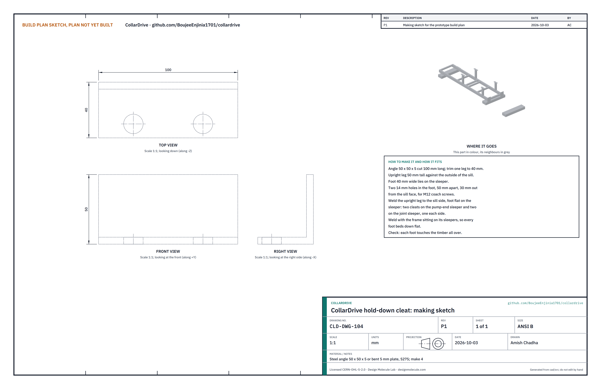

*Figure 7. Hold-down cleat making sketch (CLD-DWG-104).*

**What it is and what it is made from.** Four small angles that hold the span module down to its two sleepers. Steel angle 50 x 50 x 5, S275.

**How to make it.**

1. Saw four pieces 100 mm long; trim one leg of each to 40 mm (this is the foot).
2. Drill two 14 mm holes in each foot, 50 mm apart, 30 mm out from the upright leg.
3. Set the span module on its two sleepers at the workshop (or on site), hold each cleat with its upright leg against the outside of a sill and its foot flat on the sleeper, one each side on each sleeper, and weld the upright leg to the sill.

**How it fits the parts next to it.** The foot lies on the sleeper and takes two M12 x 100 coach screws (Figure 2).

**Check before moving on.** Every foot touches the timber all over.

### 3.6 Drive module

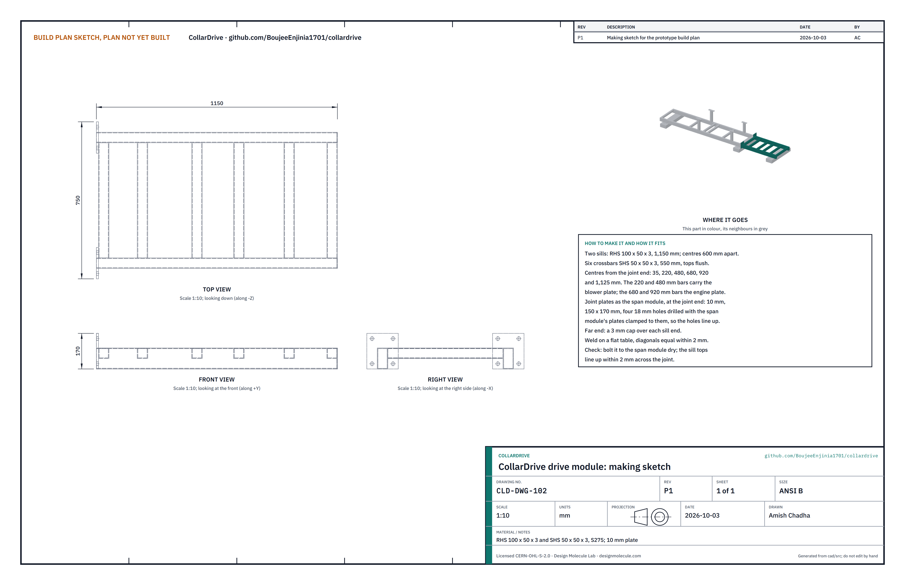

*Figure 8. Drive module making sketch (CLD-DWG-102).*

**What it is and what it is made from.** The shorter frame module that carries the engine and the blower, about 34 kg. Two RHS 100 x 50 x 3 sills, six SHS 50 x 50 x 3 crossbars, two 10 mm joint plates, two 3 mm caps, S275.

**How to make it.**

1. Saw two sills to 1,150 mm; set them 600 mm apart between centres as for the span module.
2. Fit six 550 mm crossbars, tops flush, at centres 35, 220, 480, 680, 920 and 1,125 mm from the joint end. The 220 and 480 mm bars carry the blower plate; the 680 and 920 mm bars carry the engine plate.
3. Check the diagonals equal within 2 mm and weld.
4. Weld the joint plates (drilled with the span module's, section 3.3) over the sill ends at the joint end, flush with the sill bottoms; weld 3 mm caps at the far end.

**How it fits the parts next to it.**

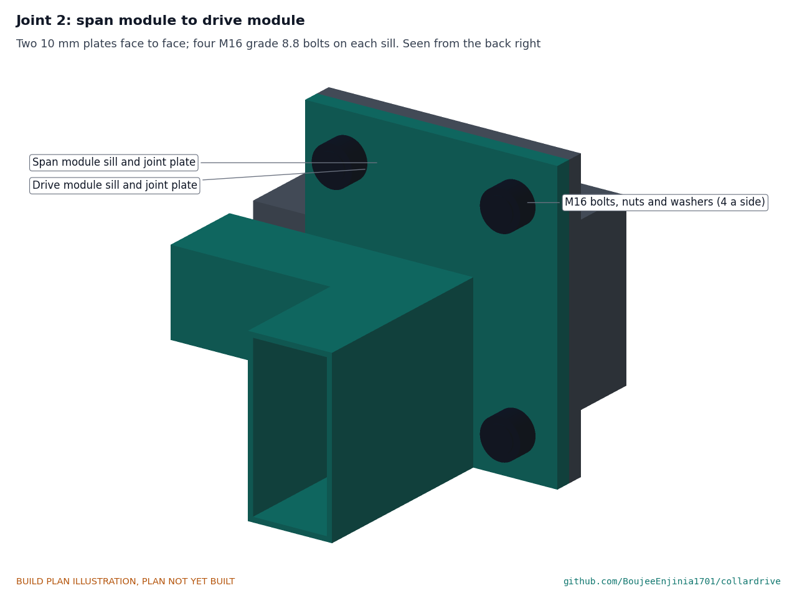

*Figure 9. Joint 2. The two 10 mm plates meet face to face; four M16 grade 8.8 bolts with a washer under each head and nut hold each sill.*

**Check before moving on.** Bolt the two modules together dry on a level floor: the sill tops line up across the joint within 2 mm and the whole frame sits on all its corners.

### 3.7 Pump wheel shaft

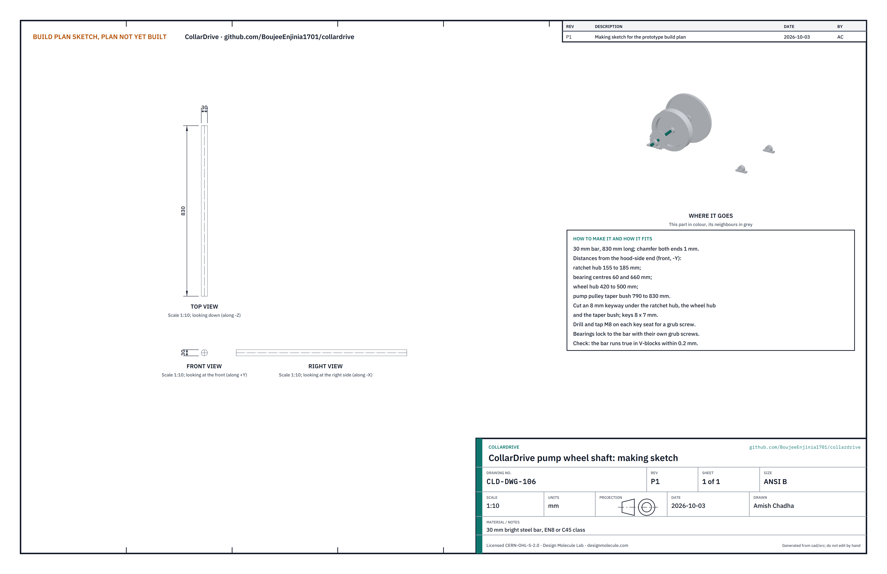

*Figure 10. Pump wheel shaft making sketch (CLD-DWG-106).*

**What it is and what it is made from.** The 30 mm shaft that carries the rope wheel, the ratchet and the pump pulley. Bright steel bar, EN8 or C45 class, 830 mm long.

**How to make it.** A local machine shop does this.

1. Cut to 830 mm; chamfer both ends 1 mm.
2. Measuring from the front end: ratchet hub 155 to 185 mm; bearing centres 60 and 660 mm; wheel hub 420 to 500 mm; pump pulley bush 790 to 830 mm.
3. Cut an 8 mm wide keyway under the ratchet hub, the wheel hub and the pulley bush; fit 8 x 7 mm keys.

**How it fits the parts next to it.** The two pillow blocks lock to it with their grub screws; the hubs are keyed and held by grub screws over the keys (Figure 6).

**Check before moving on.** Rolled on a flat table or turned in V-blocks, it runs true within 0.2 mm.

### 3.8 Rope pump wheel

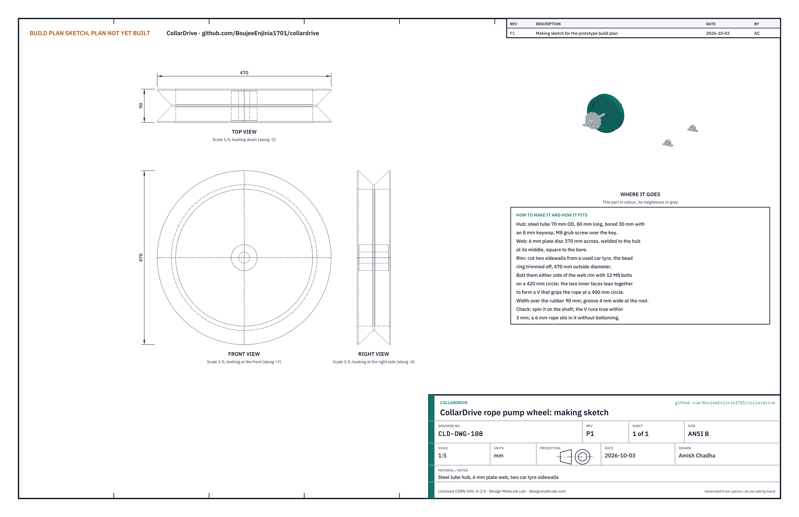

*Figure 11. Rope pump wheel making sketch (CLD-DWG-108).*

**What it is and what it is made from.** The wheel that grips the rope and pulls it up through the main. A steel hub, a 6 mm steel web and two sidewalls cut from a used car tyre: the open rope pump wheel.

**How to make it.**

1. Hub: steel tube 70 mm outside, 80 mm long, bored 30 mm with an 8 mm keyway and an M8 grub screw over it.
2. Web: cut a 370 mm disc of 6 mm plate with a 70 mm hole; weld it to the middle of the hub, square to the bore.
3. Rim: cut both sidewalls from a used car tyre, trim off the bead wire, and trim each to 470 mm outside.
4. Drill twelve 9 mm holes on a 420 mm circle through the web rim and both sidewalls together; bolt them with M8 bolts and large washers, one sidewall each side, so their inner faces lean together into a V with a 4 mm root.

**How it fits the parts next to it.** It slides onto the pump shaft with its key, 420 to 500 mm from the front end. The rope sits in the V at a 400 mm circle.

**Check before moving on.** Spun on the shaft, the V runs true within 3 mm; a 6 mm rope pressed into it grips without touching the bottom.

### 3.9 Backstop ratchet

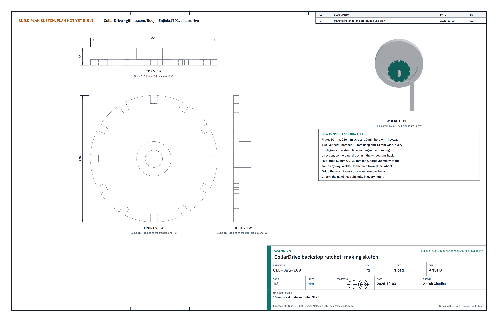

*Figure 12. Backstop ratchet making sketch (CLD-DWG-109).*

**What it is and what it is made from.** A toothed disc on the pump shaft that the pawl locks if the wheel turns backwards. 10 mm steel plate and 60 mm tube.

**How to make it.**

1. Cut a 220 mm disc of 10 mm plate; bore it 30 mm with an 8 mm keyway.
2. Cut twelve notches 16 mm deep and 14 mm wide round the edge, one every 30 degrees, with the steep face leading in the pumping direction.
3. Weld a hub of 60 mm tube, 20 mm long and bored 30 mm with the same keyway, to the face that goes toward the wheel.
4. Grind the tooth faces square and remove every burr.

**How it fits the parts next to it.** It is keyed to the shaft 155 to 185 mm from the front end, inside the hood, beside the pawl (Figure 14).

**Check before moving on.** The pawl nose drops fully into every notch.

### 3.10 Backstop pawl and post

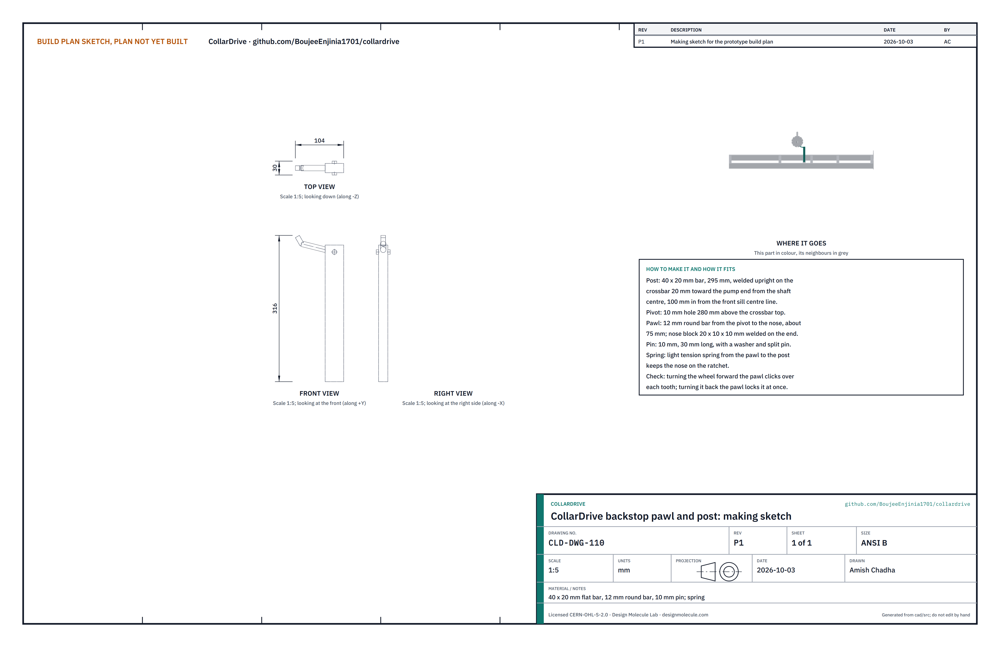

*Figure 13. Backstop pawl and post making sketch (CLD-DWG-110).*

**What it is and what it is made from.** The catch that holds the ratchet. A 40 x 20 mm flat bar post, a 12 mm round bar pawl with a nose block, a 10 mm pin and a light spring.

**How to make it.**

1. Saw the post 295 mm long; drill a 10 mm hole 280 mm up from its bottom end.
2. Weld the post upright on the crossbar 20 mm toward the pump end from the shaft centre, 100 mm in from the front sill's centre line.
3. Bend the pawl from 12 mm bar, about 75 mm from the pivot to the nose; weld a 20 x 10 x 10 mm nose block on its end and a 10 mm eye at the pivot.
4. Pin the pawl to the post with the 10 mm pin, a washer and a split pin; hook a light tension spring from the pawl to the post so the nose rests on the ratchet.

**How it fits the parts next to it.**

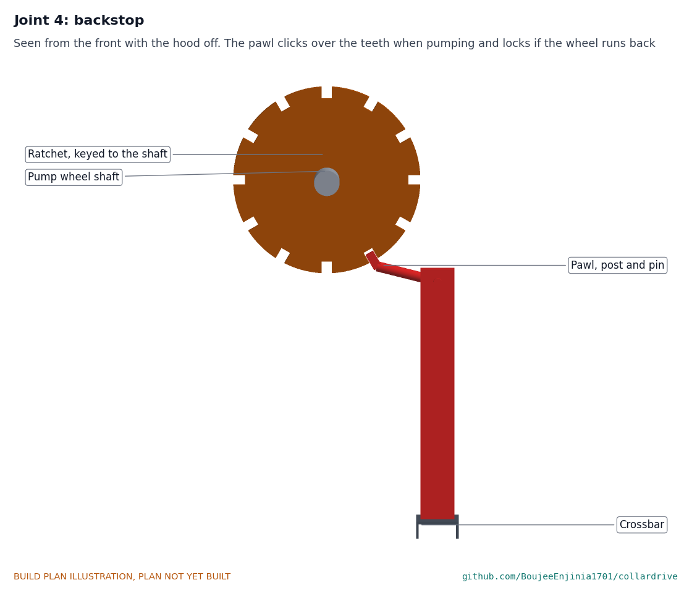

*Figure 14. Joint 4, seen from the front with the hood off. Pumping, the pawl clicks over the teeth; if the wheel runs back, the nose drops into a notch and stops it.*

**Check before moving on.** Turning the wheel forward the pawl clicks over every tooth; turning it back the pawl locks within one tooth (30 degrees).

### 3.11 Layshaft

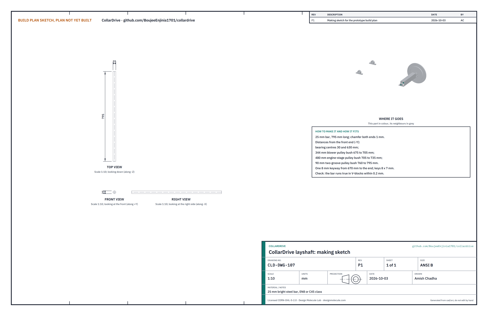

*Figure 15. Layshaft making sketch (CLD-DWG-107).*

**What it is and what it is made from.** The 25 mm shaft between the engine and the two machines. Bright steel bar, EN8 or C45 class, 795 mm long.

**How to make it.** A machine shop cuts it to 795 mm, chamfers both ends 1 mm and cuts one 8 mm keyway from 670 mm to the back end. Measuring from the front end: bearing centres 30 and 630 mm; 344 mm blower pulley 675 to 705 mm; 480 mm engine-stage pulley 705 to 735 mm; 90 mm two-groove pump pulley 760 to 795 mm.

**How it fits the parts next to it.**

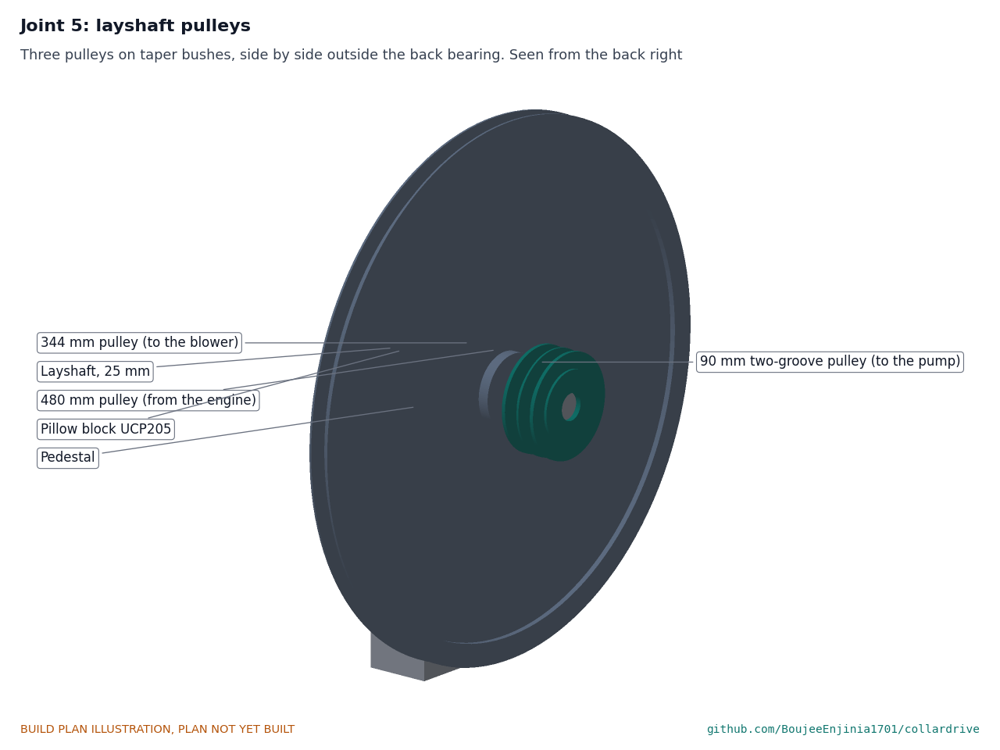

*Figure 16. Joint 5. The three pulleys sit side by side on taper bushes outside the back bearing; each lines up with the pulley it drives.*

**Check before moving on.** It runs true within 0.2 mm; the three bushes slide on with their keys.

### 3.12 Engine plate

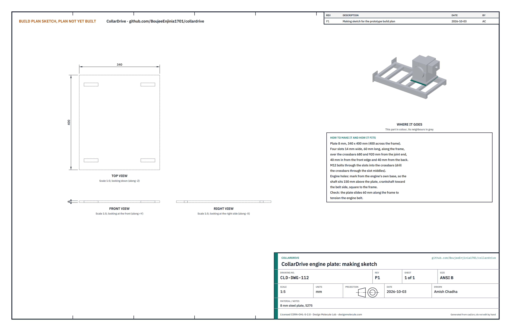

*Figure 17. Engine plate making sketch (CLD-DWG-112).*

**What it is and what it is made from.** The plate the engine bolts to, which slides to tension the engine belt. 8 mm steel plate, 340 x 400 mm.

**How to make it.**

1. Cut the plate 340 mm along the frame by 400 mm across.
2. Cut four slots 14 mm wide and 60 mm long, running along the frame, over the crossbars 680 and 920 mm from the joint end; 40 mm in from the front edge and 40 mm from the back edge.
3. Drill each crossbar 14 mm under the middle of its slots.
4. Set the engine on the plate with its shaft toward the back (belt side), square to the frame, and mark its four foot holes; drill them to suit.

**How it fits the parts next to it.**

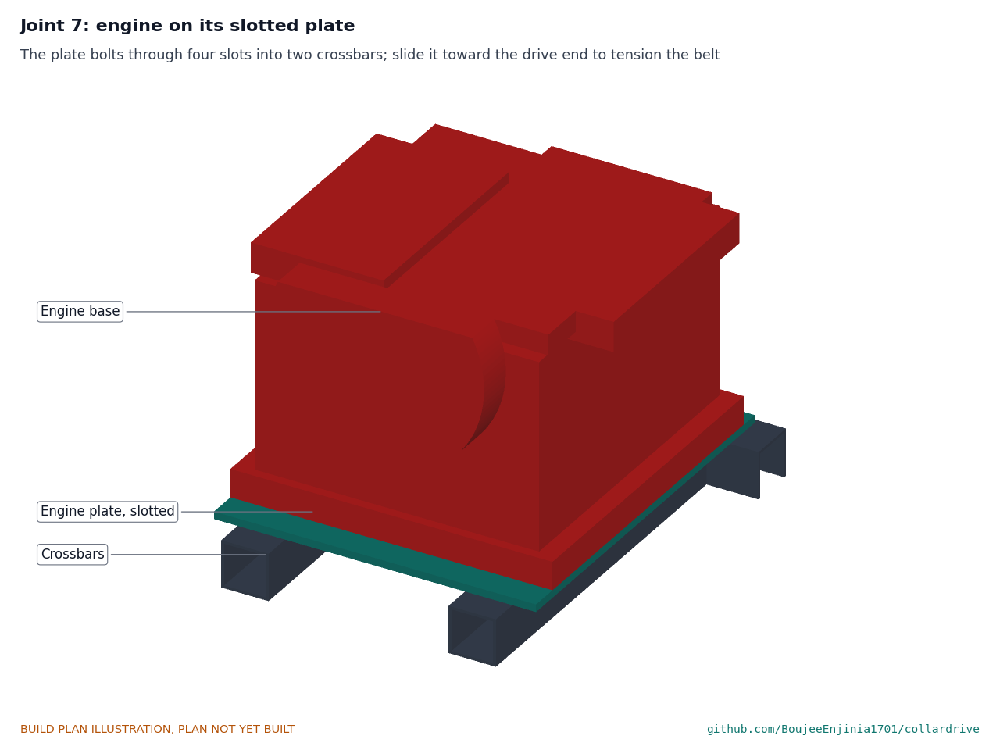

*Figure 18. Joint 7. M12 bolts through the slots into the crossbars; slide the plate toward the drive end to tension the belt.*

**Check before moving on.** The plate slides the full 60 mm with the bolts loose.

### 3.13 Blower plate

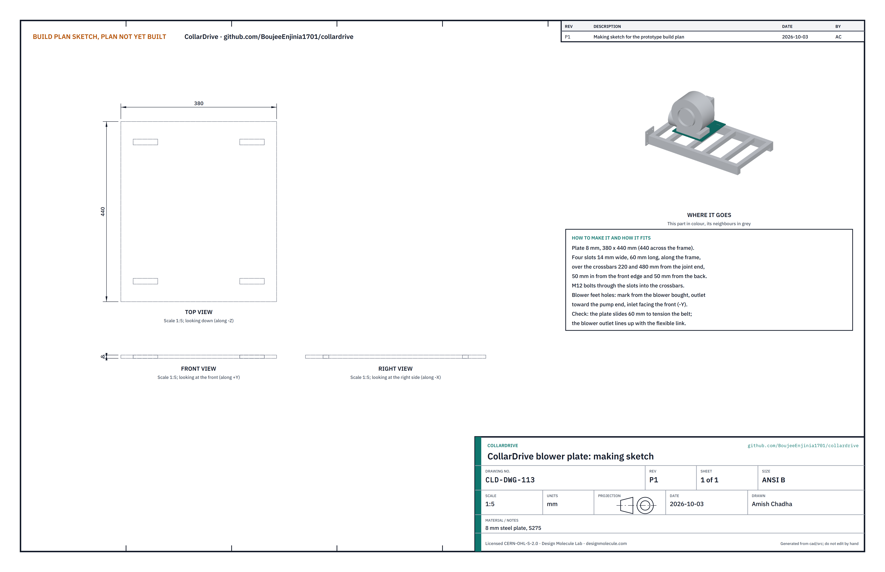

*Figure 19. Blower plate making sketch (CLD-DWG-113).*

**What it is and what it is made from.** The plate the blower bolts to. 8 mm steel plate, 380 x 440 mm.

**How to make it.** As the engine plate: four slots 14 x 60 mm along the frame over the crossbars 220 and 480 mm from the joint end, 50 mm in from the front and back edges; crossbars drilled 14 mm under the slots; blower foot holes marked from the blower with its outlet toward the pump end and its inlet facing the front.

**How it fits the parts next to it.** It bolts through its slots like the engine plate. The blower's outlet lines up with the flexible link to the duct head (Figure 29).

**Check before moving on.** The plate slides 60 mm; the outlet centre is 112 mm above the plate.

### 3.14 Blower inlet guard

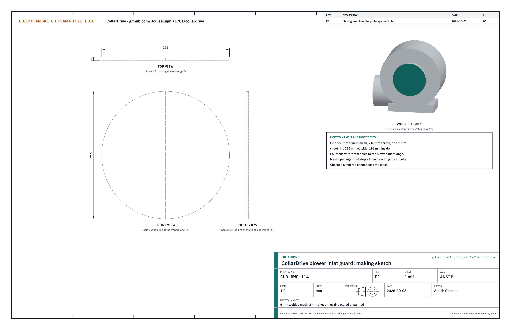

*Figure 20. Blower inlet guard making sketch (CLD-DWG-114).*

**What it is and what it is made from.** A mesh cover over the blower's air inlet. 6 mm welded mesh on a 2 mm sheet ring.

**How to make it.** Cut a ring 216 mm outside and 196 mm inside from 2 mm sheet with four tabs and 7 mm holes to match the inlet flange; weld a 216 mm disc of 6 mm mesh to it.

**How it fits the parts next to it.** It bolts over the blower inlet on the front face with four M6 bolts.

**Check before moving on.** A 6 mm rod cannot pass through the mesh.

### 3.15 Clutch lever and pivot post

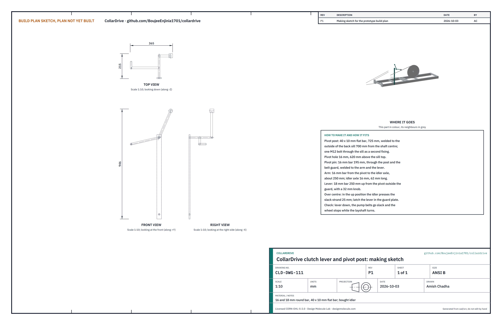

*Figure 21. Clutch lever and pivot post making sketch (CLD-DWG-111).*

**What it is and what it is made from.** The lever that presses an idler pulley onto the pump belts to start the pump, and lets them go slack to stop it. 40 x 10 mm flat bar, 16 and 18 mm round bar, a bought 60 mm flat idler pulley on a sealed bearing.

**How to make it.**

1. Pivot post: saw 725 mm of 40 x 10 mm bar; drill a 16 mm hole 25 mm from the top and a 14 mm hole 40 mm from the bottom.
2. Weld the post upright to the outside of the back sill, 700 mm toward the drive end from the shaft centre, its bottom 80 mm below the sill top; put an M12 bolt through the 14 mm hole and the sill as a second fixing.
3. Pivot pin: 16 mm bar, 195 mm. Arm: 16 mm bar about 250 mm from the pivot down to the idler axle. Idler axle: 16 mm bar, 62 mm. Lever: 18 mm bar, 250 mm up from the pivot, with a 32 mm knob.
4. Weld the arm and the lever to the pivot pin at the angles on the sketch, and the idler axle to the arm; fit the idler with a washer and a split pin.

**How it fits the parts next to it.**

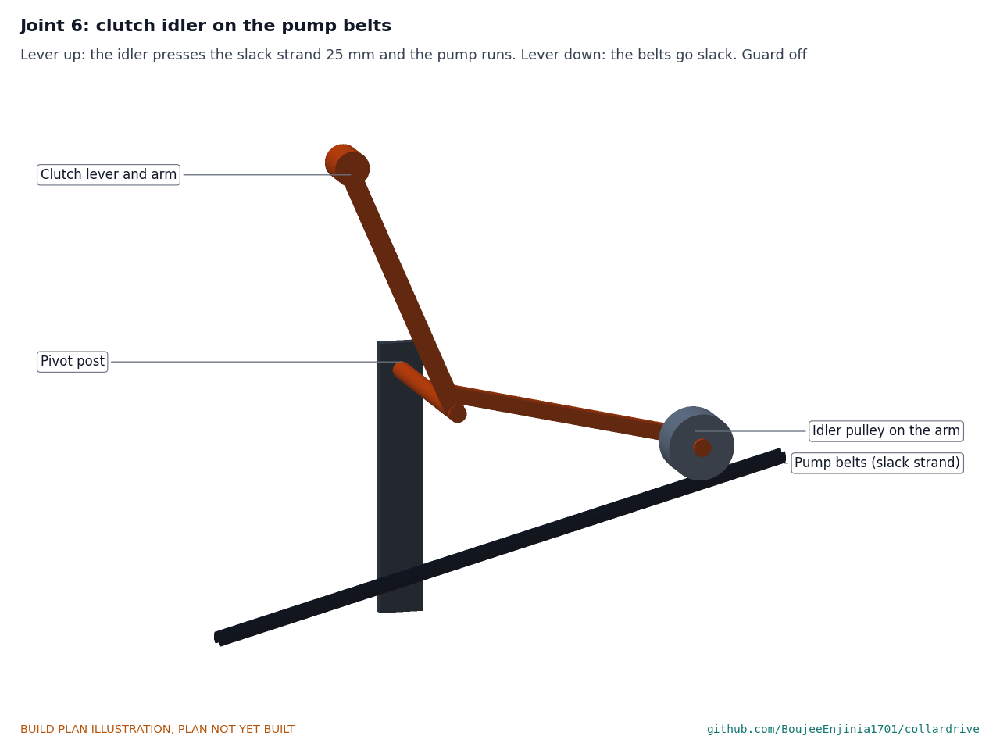

*Figure 22. Joint 6, guard off. Lever up: the idler presses the slack upper strand of the pump belts 25 mm and the pump runs. Lever down: the belts go slack and the wheel stops.*

**Check before moving on.** The pin turns freely in the post; the lever goes over centre and stays in the up position under belt load (checked in step 8).

### 3.16 Guide block

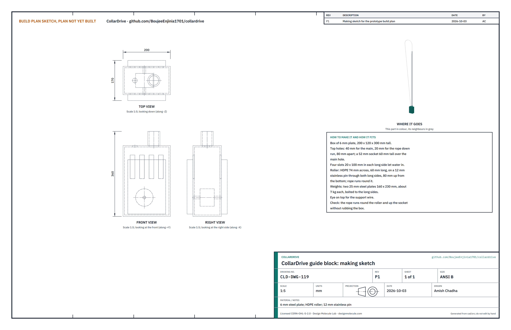

*Figure 23. Guide block making sketch (CLD-DWG-119).*

**What it is and what it is made from.** The weighted box at the bottom of the shaft where the rope turns from its down run into the rising main. 6 mm steel plate, a 74 mm HDPE roller on a 12 mm stainless pin, two 25 mm steel weights.

**How to make it.**

1. Cut and weld a box 200 x 120 x 300 mm tall from 6 mm plate.
2. In the top, 80 mm apart on the long centre line: a 40 mm hole for the main and a 20 mm hole for the rope. Weld a 52 mm socket 60 mm tall over the main's hole.
3. Cut four 20 x 100 mm slots in each long side to let water in.
4. Turn an HDPE roller 74 mm across and 60 mm long with a 12 mm bore; fit it on a 12 mm stainless pin through both long sides, 80 mm up from the bottom, under the middle of the two top holes; peen the pin ends.
5. Bolt a 25 x 160 x 230 mm steel weight (about 7 kg) to each long side. Weld an eye on top for the support wire.

**How it fits the parts next to it.**

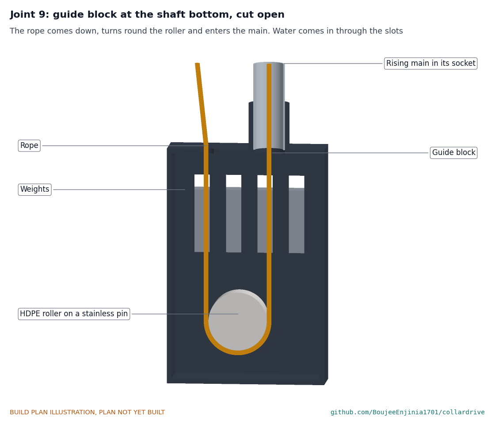

*Figure 24. Joint 9. The rope comes down through the small hole, turns round the roller and goes up into the main, which is solvent-welded into the socket.*

**Check before moving on.** A rope with pistons pulls round the roller and up the socket without rubbing the box.

### 3.17 Rope pistons (make 70)

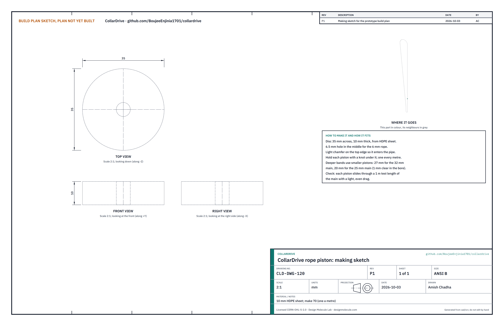

*Figure 25. Rope piston making sketch (CLD-DWG-120).*

**What it is and what it is made from.** Plastic discs on the rope that push water up the main. 10 mm HDPE sheet; for the 30 m kit, 70 of them on 70 m of 6 mm polypropylene rope.

**How to make it.** Cut discs 35 mm across with a hole saw, drill a 6.5 mm hole in the middle and chamfer the top edge lightly. For deeper bands make 27 mm discs for the 32 mm main and 20 mm discs for the 25 mm main (1 mm clear in the bore). Thread them on the rope one every metre, each held by a knot under it.

**How it fits the parts next to it.** Each piston slides in the main with 0.6 mm clear all round.

**Check before moving on.** Every piston slides through a 1 m test length of the main with a light, even drag.

### 3.18 Pipe head plate and clamp

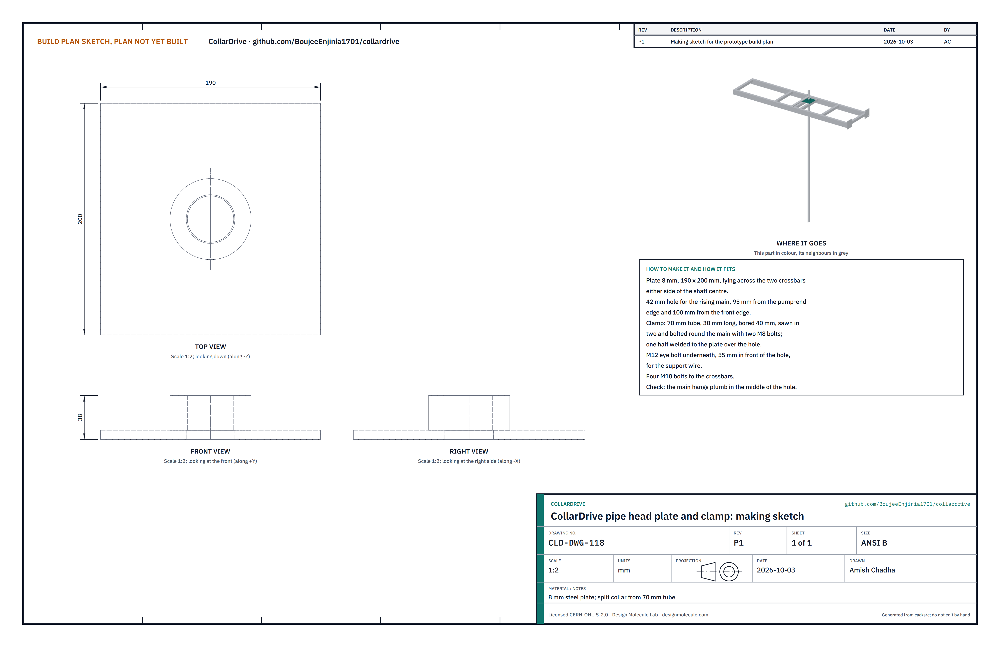

*Figure 26. Pipe head plate and clamp making sketch (CLD-DWG-118).*

**What it is and what it is made from.** The plate across two crossbars that carries the top of the rising main. 8 mm plate, a split collar from 70 mm tube, an M12 eye bolt.

**How to make it.**

1. Cut the plate 190 x 200 mm. Drill a 42 mm hole 95 mm from the pump-end edge and 100 mm from the front edge.
2. Bore a 30 mm length of 70 mm tube to 40 mm; saw it in half along its length; weld lugs for two M8 bolts. Weld one half to the plate over the hole.
3. Drill 13 mm for the eye bolt 55 mm in front of the hole; drill four 11 mm holes to bolt the plate to the crossbars either side of the shaft centre with M10 bolts.

**How it fits the parts next to it.**

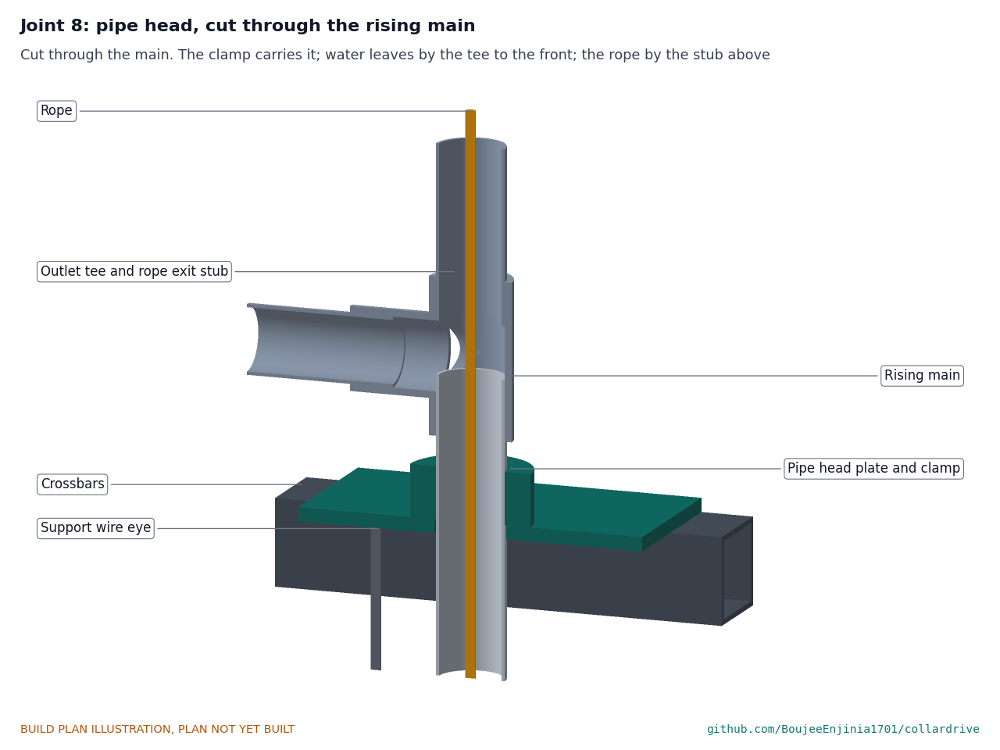

*Figure 27. Joint 8. The clamp grips the main just below the tee; water leaves by the tee's side outlet; the rope leaves by the stub above; the support wire hangs from the eye bolt.*

**Check before moving on.** The main hangs plumb in the middle of the hole.

### 3.19 Duct saddle and strap

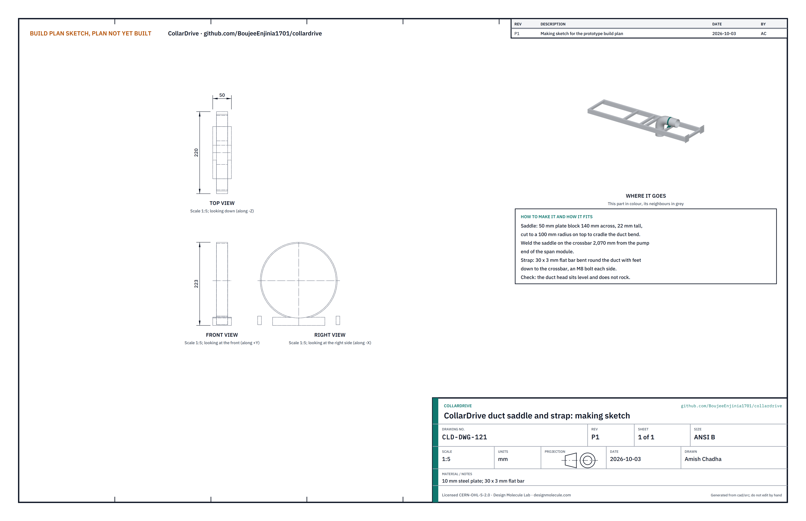

*Figure 28. Duct saddle and strap making sketch (CLD-DWG-121).*

**What it is and what it is made from.** The seat for the rigid duct bend. A 50 mm wide block of steel plate and a 30 x 3 mm strap.

**How to make it.** Cut a block 50 mm along the frame, 140 mm across and 22 mm tall, with a 100 mm radius cradle on top; weld it on the crossbar 2,070 mm from the pump end. Bend the strap round the 200 mm duct with feet down to the crossbar and drill each foot for an M8 bolt.

**How it fits the parts next to it.**

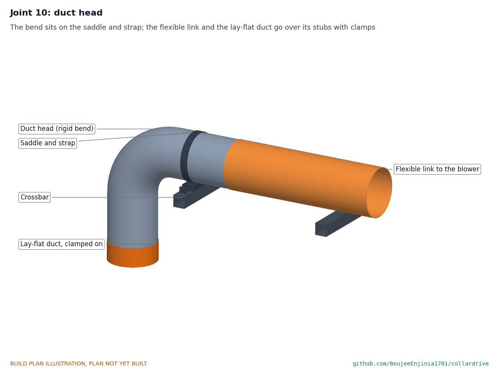

*Figure 29. Joint 10. The bend sits on the saddle under the strap; the flexible link and the lay-flat duct go over its stubs and are clamped.*

**Check before moving on.** The bend sits level and does not rock.

### 3.20 Layshaft cover

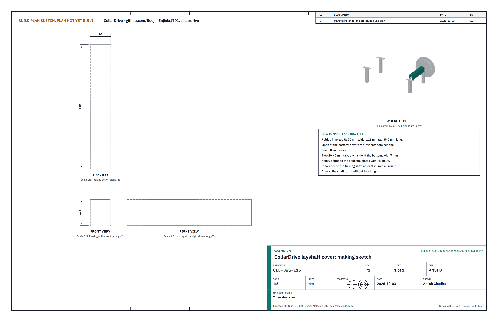

*Figure 30. Layshaft cover making sketch (CLD-DWG-115).*

**What it is and what it is made from.** A folded cover over the turning layshaft between its bearings. 2 mm steel sheet.

**How to make it.** Fold an inverted U 90 mm wide, 115 mm tall and 540 mm long; add two small tabs at each end with 7 mm holes, to bolt to the pedestal plates with M6 bolts.

**How it fits the parts next to it.** It sits over the shaft between the two pillow blocks with at least 20 mm clear all round.

**Check before moving on.** The shaft turns without touching it.

### 3.21 Belt guard

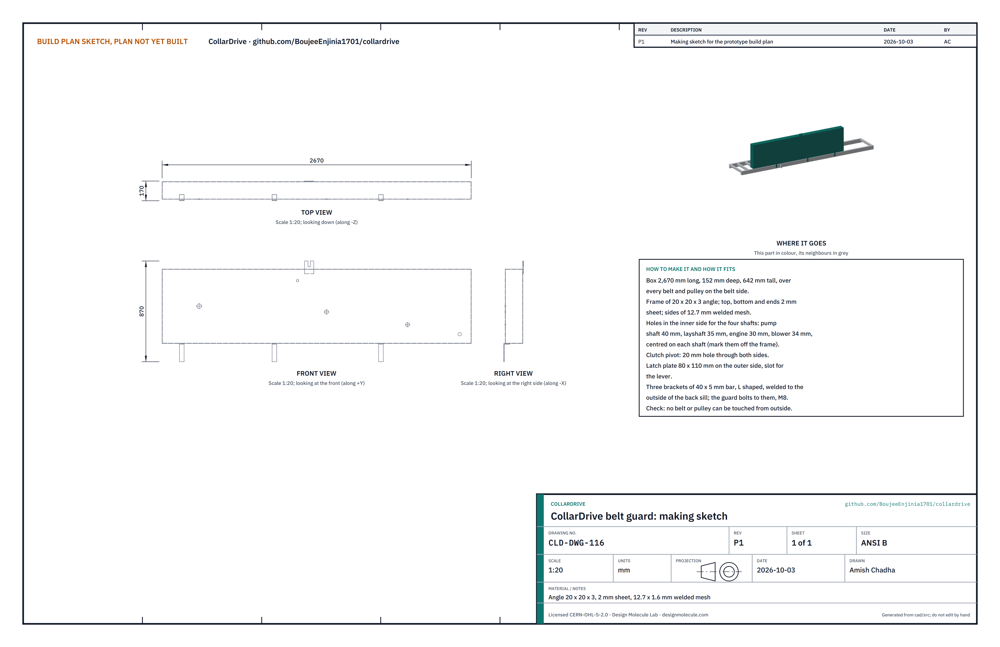

*Figure 31. Belt guard making sketch (CLD-DWG-116).*

**What it is and what it is made from.** The long box that encloses every belt and pulley on the back of the frame, with three brackets. Angle 20 x 20 x 3, 2 mm sheet, 12.7 x 1.6 mm welded mesh, 40 x 5 mm flat bar.

**How to make it.**

1. Weld a frame of angle 2,670 mm long, 152 mm deep and 642 mm tall.
2. Skin the top, bottom and both ends with 2 mm sheet and both long sides with mesh.
3. Mark the shaft centres off the assembled frame and cut holes in the inner side: pump shaft 40 mm, layshaft 35 mm, engine shaft 30 mm, blower shaft 34 mm. Cut a 20 mm hole through both sides for the clutch pivot pin.
4. Weld an 80 x 110 mm latch plate with a slot for the lever on the outer side.
5. Bend three L-shaped brackets from 40 x 5 mm bar and weld them to the outside of the back sill, one 320 mm toward the pump end from the shaft centre and two 480 mm and 1,400 mm toward the drive end; drill them for M8 bolts.

**How it fits the parts next to it.** The guard sits on the three brackets, bolted with M8 bolts; the clutch pivot passes through it and the lever outside it latches in the plate.

**Check before moving on.** With the guard on, no belt or pulley can be touched from outside; the shafts turn without touching the hole edges.

### 3.22 Pump wheel hood

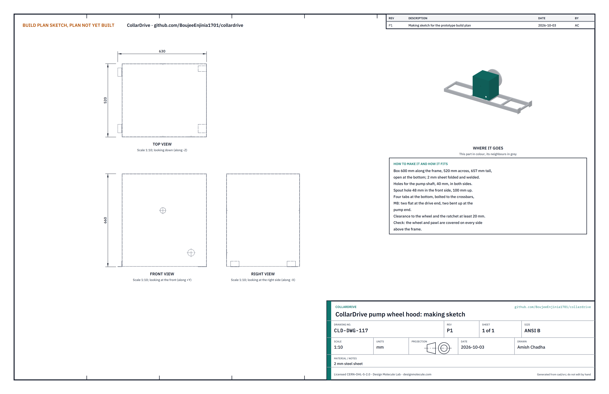

*Figure 32. Pump wheel hood making sketch (CLD-DWG-117).*

**What it is and what it is made from.** A box over the rope wheel, the ratchet and the pawl. 2 mm steel sheet.

**How to make it.** Fold and weld a box 600 mm along the frame, 520 mm across and 657 mm tall, open at the bottom. Cut 40 mm holes for the pump shaft in both sides and a 48 mm hole for the spout in the front side, 100 mm up. Add four tabs at the bottom with 9 mm holes: two flat at the drive end, two bent up at the pump end, bolted to the crossbars with M8 bolts.

**How it fits the parts next to it.** It covers the wheel with at least 20 mm clear; the rope and main pass through its open bottom into the shaft.

**Check before moving on.** The wheel, ratchet and pawl are covered on every side above the frame.

### 3.23 Exhaust extension

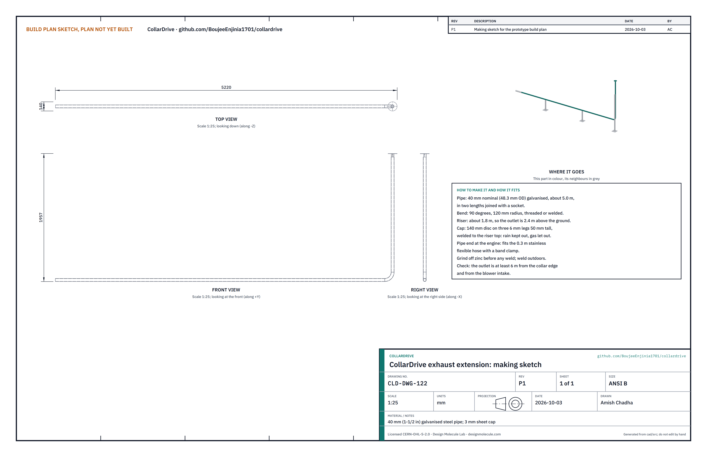

*Figure 33. Exhaust extension making sketch (CLD-DWG-122).*

**What it is and what it is made from.** The pipe that carries the exhaust away from the shaft and the blower intake to a riser. 40 mm (1-1/2 in) galvanised steel pipe, a 90 degree bend, a rain cap; a 0.3 m stainless flexible hose with band clamps.

**How to make it.**

1. Join about 5.0 m of 40 mm pipe from two lengths with a socket.
2. Fit a 90 degree bend of 120 mm radius and a riser about 1.8 m long, so the outlet is 2.4 m above the ground.
3. Cap: weld a 140 mm disc of 3 mm sheet on three 6 mm legs 50 mm tall to the riser top. Grind the zinc off wherever you weld, outdoors.

**How it fits the parts next to it.**

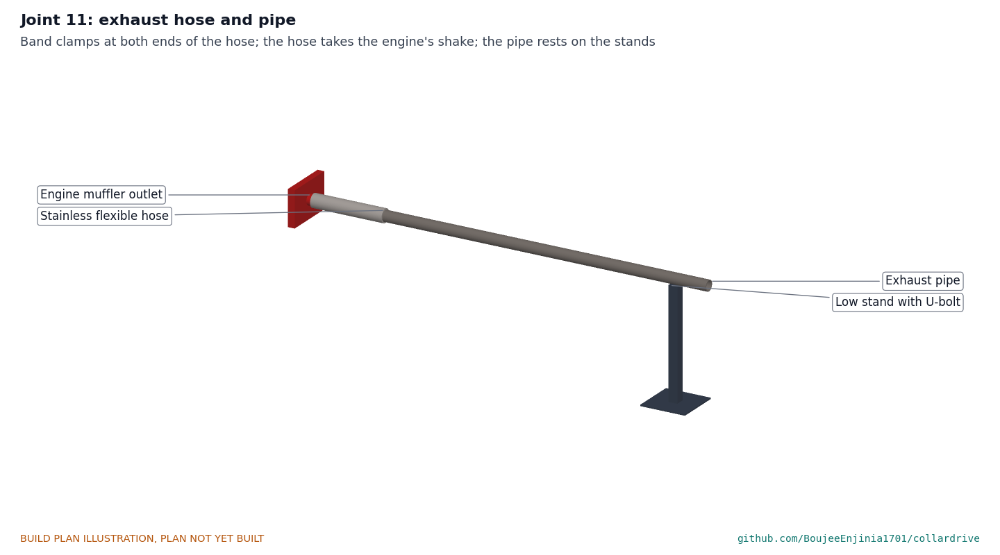

*Figure 34. Joint 11. The flexible hose is clamped to the muffler outlet and the pipe; it takes the engine's shake. The pipe rests in U-bolts on the stands.*

**Check before moving on.** The outlet is at least 6 m from the collar edge and from the blower intake.

### 3.24 Exhaust stands (make 3)

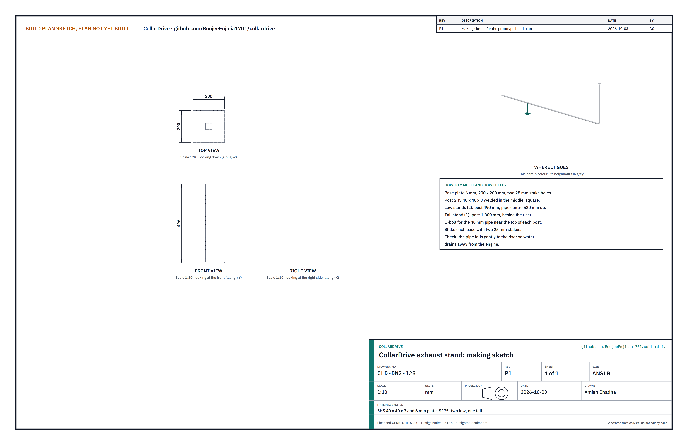

*Figure 35. Exhaust stand making sketch (CLD-DWG-123).*

**What it is and what it is made from.** Posts that hold the exhaust pipe and the riser. SHS 40 x 40 x 3, 6 mm plate, U-bolts.

**How to make it.** Cut 200 x 200 mm base plates of 6 mm with two 28 mm stake holes; weld the posts square in the middle: two low posts 490 mm and one tall post 1,800 mm. Drill each for a 48 mm U-bolt near the top.

**How it fits the parts next to it.** The low stands carry the pipe 520 mm above the ground; the tall stand stands beside the riser; each base is staked with two 25 mm stakes.

**Check before moving on.** The pipe falls gently toward the riser so condensate drains away from the engine.

### 3.25 Bought components

*Table 2. Bought components and what to do to them.*

| Component | Specification | What to do to it |
| --- | --- | --- |
| Engine | Single-cylinder 4-stroke petrol, 196 cc class, 4.8 kW (6.5 hp) at 3,600 rpm, horizontal 19.05 mm keyed shaft | Set the governor to 2,800 rpm; fit the 80 mm pulley |
| Blower | Belt-driven centrifugal, about 300 mm wheel, 200 mm outlet, at least 0.15 m³/s at 500 Pa at 2,000 rpm, under 0.5 kW | Fit the 80 mm pulley and the inlet guard |
| Pillow blocks | Two UCP206 (30 mm), two UCP205 (25 mm) with grease nipples | Grease; mark bolt holes on the pedestals |
| Pulleys and bushes | A section cast iron: 80 mm engine, 480, 344 and 90 mm two-groove on the layshaft, 560 mm two-groove pump, 80 mm blower; taper bushes | Bore or bush to the shafts |
| V-belts | A section: one for the engine stage, two matched for the pump, one for the blower; lengths from CLD-CAL-001, checked at fitting | None |
| Idler | 60 mm wide flat idler on a sealed bearing, 16 mm bore | None |
| Rising main and tee | 40 mm PVC PN10 pipe with solvent-weld sockets (32 mm or 25 mm in deeper shafts), a 40 mm tee | Cut a 100 mm rope exit stub above the tee |
| Rope | 6 mm polypropylene, about 5 kN breaking load, 70 m for a 30 m shaft | Thread the pistons |
| Support wire | 6 mm galvanised wire rope with four clips | None |
| Duct | 200 mm galvanised 90 degree bend with stubs; 200 mm lay-flat duct with couplings and hanging rings, 30 m; 0.7 m flexible link and clamps | None |
| Hoses | 40 mm discharge hose, 10 m; stainless exhaust flexible hose 48 mm, 0.3 m | None |
| Fasteners | M16 x 60 grade 8.8 (8), M12 x 100 coach screws (8), M12, M10, M8 and M6 bolts, washers and nuts | None |
| Gas detector | Personal carbon monoxide and oxygen detector with audible and vibrating alarm, calibrated, with bump-test gas | Charge, bump test and set the alarms before any work below ground |

## 4. Putting it together

On site, the collar is fenced first, with a gate on the drive side. All work over the opening is done from beside the frame, never from on it.

### Step 1: sleepers and stakes

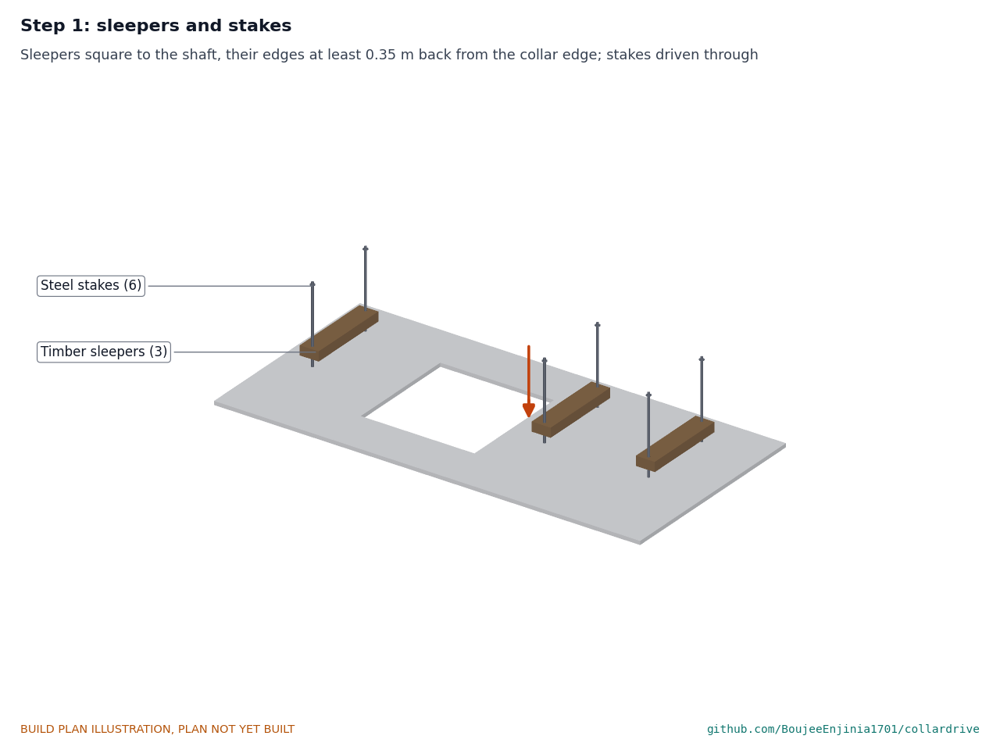

**Hold point:** safety stop S2. Lay the three sleepers square to the shaft: one at the pump end, one at the joint and one under the drive module, their edges at least 0.35 m back from the collar edge. Drive two stakes through each.

### Step 2: span module onto the sleepers

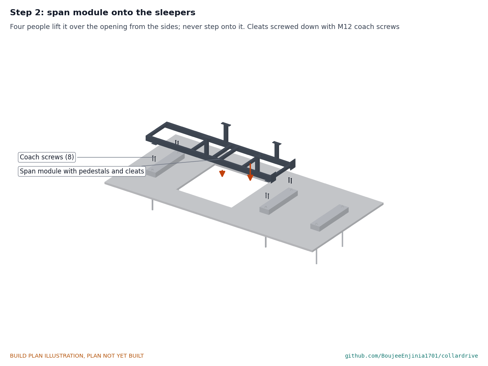

**Hold point:** safety stop S3. Four people carry the span module and lower it over the opening from the sides onto the pump-end and joint sleepers. Fix the four cleats with two M12 x 100 coach screws each.

### Step 3: drive module and joint bolts

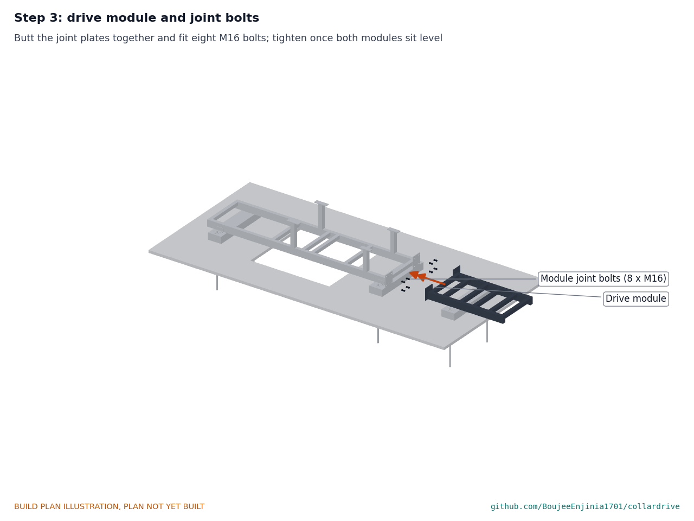

Set the drive module on the joint and drive-end sleepers, butt the joint plates together and fit the eight M16 bolts. Pack the sleepers until both modules sit level within 5 mm over their length, then tighten the bolts.

### Step 4: pump shaft assembly onto its pedestals

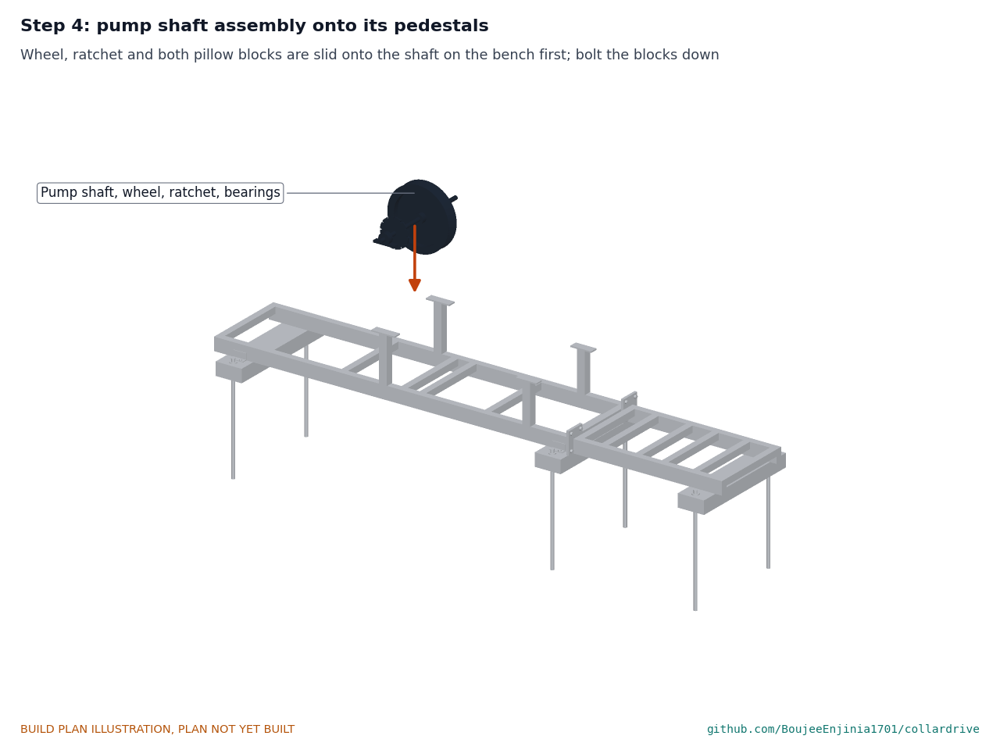

On the bench, slide the ratchet, the wheel and both UCP206 blocks onto the pump shaft with their keys, in the order of the sketch. Lift the assembly (about 30 kg, two people) onto the pump pedestals and bolt the blocks down; lock the grub screws.

### Step 5: pump pulley and backstop pawl

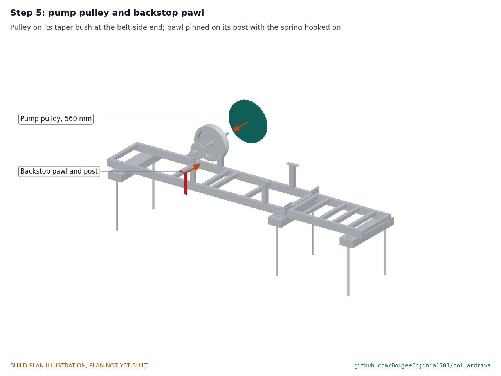

Fit the 560 mm pulley on its taper bush at the back end of the shaft. Pin the pawl on its post and hook on its spring. Check the backstop as in section 3.10.

### Step 6: layshaft assembly onto its pedestals

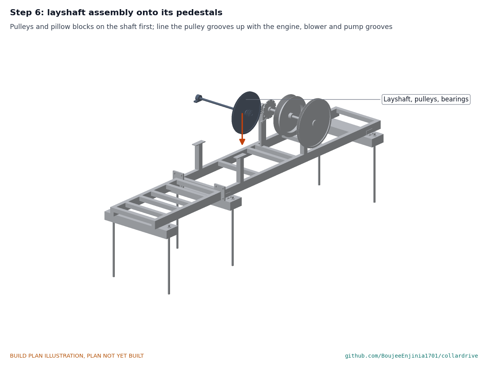

Fit the three pulleys and both UCP205 blocks to the layshaft on the bench, lift it onto the layshaft pedestals and bolt it down. Line each pulley's groove up with the groove it will drive, within 1 mm, using a straight edge or a string.

### Step 7: engine and blower on their plates

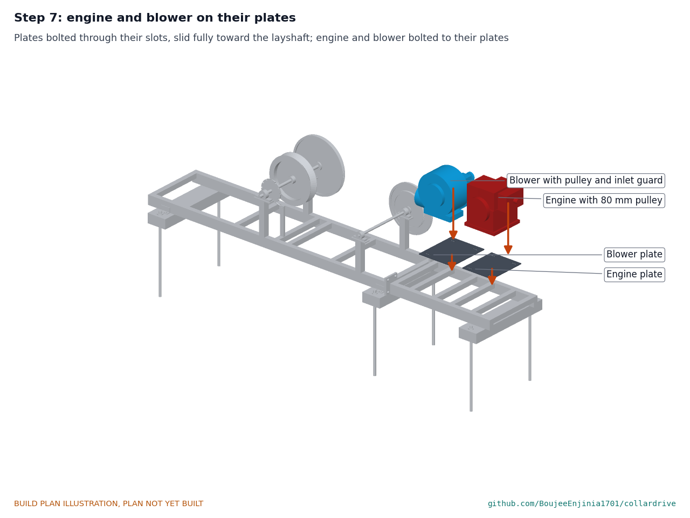

Bolt the engine plate and the blower plate through their slots, slid fully toward the layshaft. Bolt the engine (about 16 kg) and the blower (about 30 kg, two people) to their plates.

### Step 8: belts and clutch

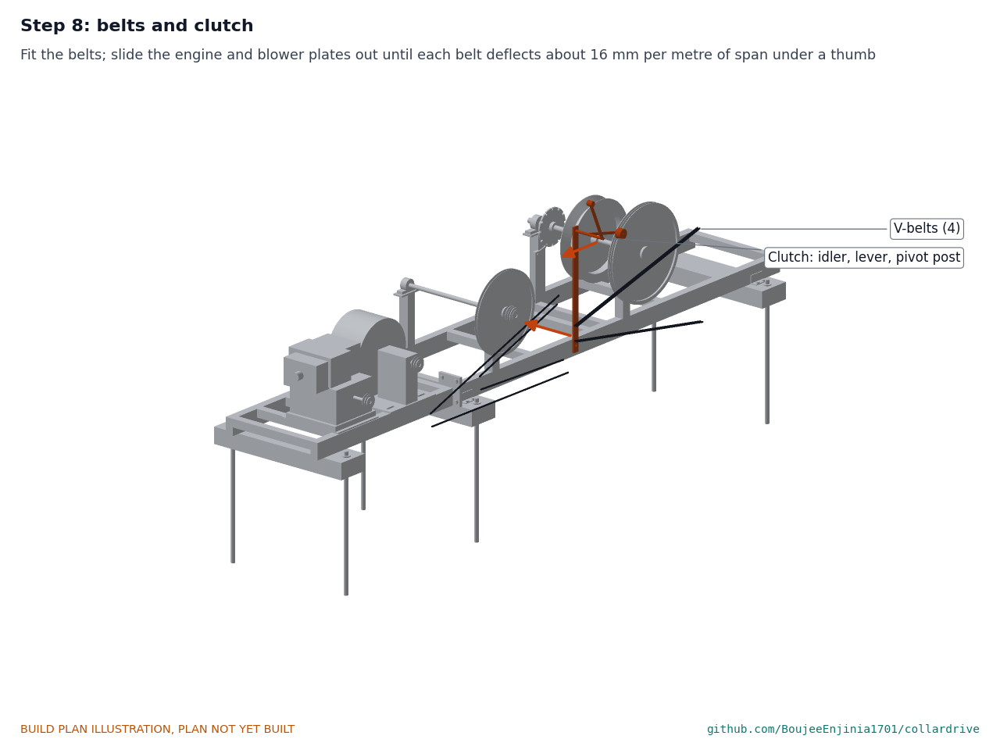

Fit the pivot post, the clutch lever and the idler. Put on the engine belt, the two pump belts and the blower belt. Slide the engine and blower plates out until each belt deflects about 16 mm per metre of span under a firm thumb (about 18 mm on the engine and pump belts, 11 mm on the blower belt), with the clutch lever up. Tighten the plate bolts. Turn the drive by hand with the spark plug lead off.

### Step 9: guide block, rising main and rope down the shaft

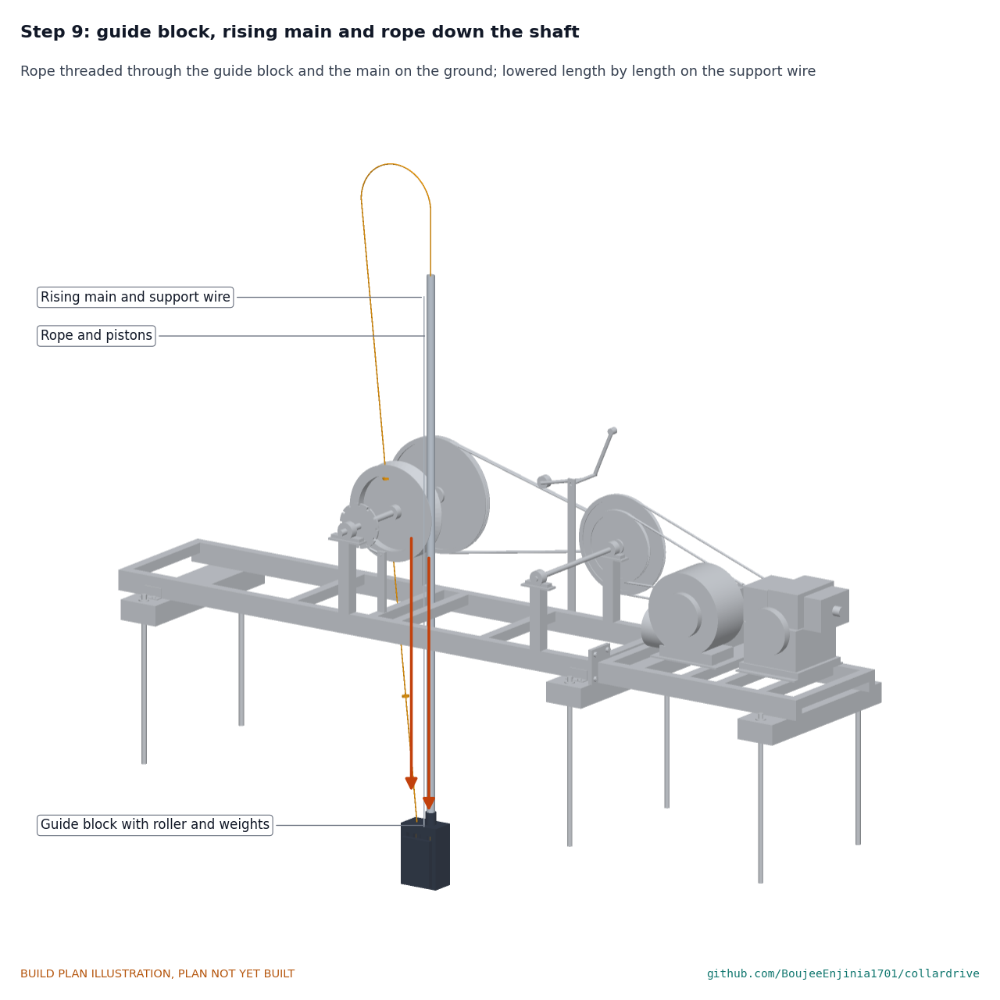

**Hold point:** safety stop S4. On the ground, thread the rope with its pistons down through the guide block's small hole, round the roller and up into the first length of main, then solvent-weld the main into the guide block's socket. Lower the guide block on the support wire, adding main lengths one at a time (solvent-welded, cured as the maker says) and feeding the rope's down run beside it. Clip the support wire to the main every 3 m.

### Step 10: pipe head, outlet tee and discharge hose

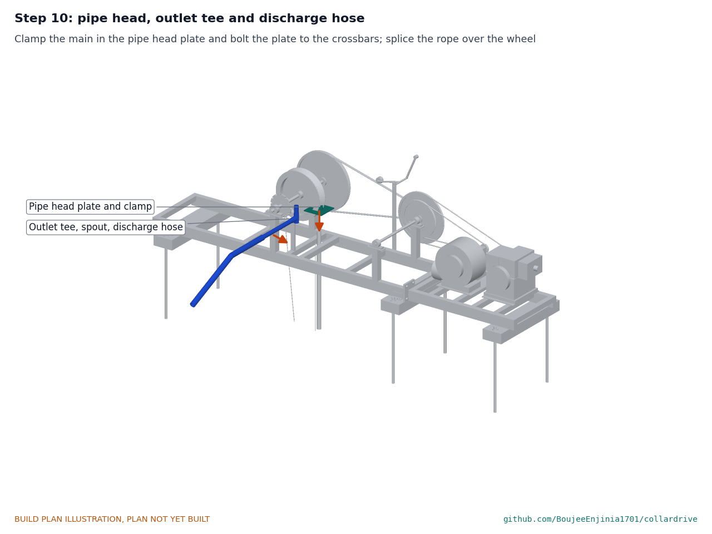

Clamp the top of the main in the pipe head plate and bolt the plate to the crossbars; hang the support wire on the eye bolt. Fit the tee with its rope exit stub and the spout through the hood's hole line, and clamp on the discharge hose, laid away from the collar. Take the rope's two ends over the wheel, pull the slack out and splice them.

### Step 11: duct head, lay-flat duct and flexible link

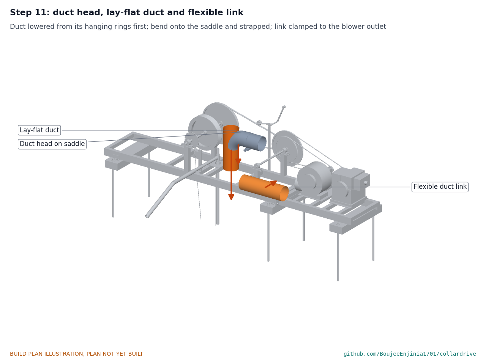

Lower the lay-flat duct on its hanging rings to the working level and tie it off. Clamp its top over the duct head's down stub, set the bend on its saddle and strap it down. Clamp the flexible link between the bend and the blower outlet.

### Step 12: guards and hood

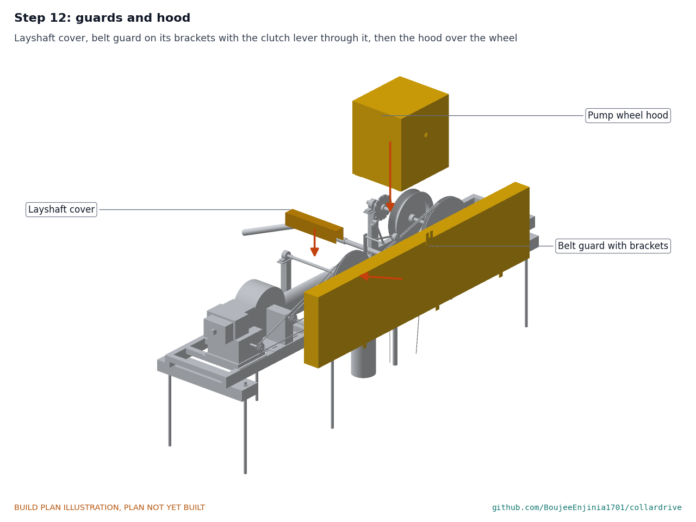

Bolt on the layshaft cover. Fit the belt guard on its brackets with the clutch pivot pin through it and the lever through the latch plate. Bolt the hood over the wheel. Fit the blower inlet guard if not already on.

### Step 13: exhaust extension

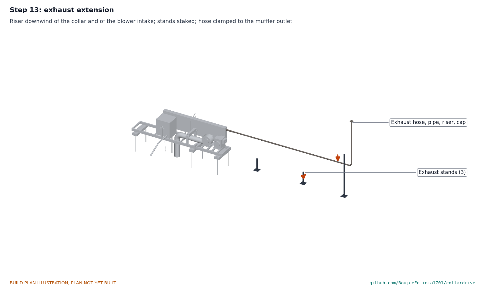

Set the stands out so the riser is downwind of the prevailing wind and at least 6 m from the collar edge and from the blower intake; stake them. Lay the pipe in the U-bolts with a gentle fall to the riser and clamp the flexible hose to the muffler outlet. **Hold point:** safety stop S5.

## 5. First checks

These are the checks a TRL 4 test report would record; this plan only lists them. Requirement numbers are those of CLD-REQ-001. None involves anyone going below the collar.

*Table 3. First checks.*

| Check | Requirement | How | Pass when |
| --- | --- | --- | --- |
| Engine position | R1 | Look | No combustion part below the collar; engine on the drive module |
| Exhaust distance | R2 | Tape from the outlet to the collar edge and to the blower intake | 6 m or more to each; riser downwind |
| Carbon monoxide at the intake | R2 | Gas detector held at the blower intake for 10 minutes of running, wind from several directions on different days | No alarm; reading stays at background |
| Water flow | R3 | Time a 20 L bucket at the discharge hose, on a test well or tower at 20 m | 60 L/min or more |
| Flow at depth | R4 | As above at the deepest available head, with the right main for its band | Recorded against CLD-CAL-001 Table 2 |
| Air at the duct end | R5 | Anemometer across the outlet of 30 m of duct laid out on the surface | 0.1 m³/s or more |
| Shared drive | R6 | Run pump and blower together for 1 hour | Engine holds speed; belts do not slip or smoke |
| Collar fit | R7 | Measure the sleeper edges from the collar edge | 0.35 m or more |
| Guarding | R9 | Walk round with a 12 mm rod and try to reach any belt, pulley or shaft | Nothing reached |
| Backstop | R9 | Stop the engine with the pump lifting | Wheel stops within one tooth; no running back |
| Clutch | R6, R9 | Lever down with the engine running | Wheel stops; blower keeps running |
| Heaviest piece | R8 | Weigh the span module | 75 kg or less (69.6 kg designed) |
| Parts cost | R10 | Sum the receipts | Recorded against the value-engineering target |

## 6. Safety stops

Stop at each point. Carry on only when everything listed is true.

- **S1. Before any workshop work.** Welding area ventilated, fire extinguisher at hand, welding helmet, leather gloves and apron, safety glasses and hearing protection in use; safety boots for all lifting. Grind zinc off galvanised parts before welding them, outdoors, wearing a P2 or N95 respirator.
- **S2. Before any work at the collar.** The collar is fenced with a gate; the ground round it is checked for cracks and loose lips; nobody works within 1 m of the open edge without a harness tied to an anchor away from the collar; the shaft is empty of people.
- **S3. Before lifting the span module over the opening.** Four people, one each corner, lifting from beside the collar, never from the frame; the lift is called by one person; nothing is carried over anyone.
- **S4. Before lowering anything down the shaft.** Nobody is in the shaft; the load hangs on the support wire, held by two people with a turn round a crossbar; no one leans over the opening.
- **S5. Before the first engine start.** Every guard, the hood, the layshaft cover and the inlet guard fitted; the backstop works; the exhaust extension fitted with its outlet 6 m or more from the collar and the intake; the clutch lever down; nobody within 1 m of the frame; fuel filled with the engine cold, away from the collar.
- **S6. Before touching the drive, the rope or the belts.** Engine stopped, spark plug lead off, the wheel held by the backstop; never reach into the guard with the engine running.
- **S7. Before anyone goes below ground (outside this plan).** The gas detector, bump tested, shows normal oxygen and no carbon monoxide at the working level after the blower has run; the site's own rules for shaft entry are followed. CollarDrive does not make a shaft safe on its own.
- **S8. Refuelling.** Engine stopped and cool; fuel kept and poured on the drive side, away from the collar and the blower intake.

## 7. Tools, skills and workspace

**Tools.** Metal chop saw or bandsaw for hollow section up to 100 x 50; 115 or 125 mm angle grinder with cutting and flap discs; pillar drill to 20 mm with drills 6 to 18 mm; hole saws for 35 to 52 mm; stick welder of about 140 to 160 A for 2.5 and 3.2 mm E6013; welding table, clamps and magnetic squares; sheet metal folder or a bench vice and hammer for 2 mm sheet; ring spanners 10, 13, 17, 19 and 24 mm; Allen keys for grub screws; sledgehammer for the stakes; 5 m tape, 1 m steel rule, engineer's square, spirit level, straight edge and string line; PVC solvent cement; utility knife for the tyre sidewalls. A local machine shop turns the shafts' ends and cuts the keyways and taper bush bores.

**Skills.** Ordinary welding and fabrication; care with belt alignment; rope splicing (a long splice or a sewn joint for polypropylene). No electrical work.

**Workspace.** A covered workshop about 6 x 4 m with a level floor for the frame; on site, a fenced collar with level ground for the sleepers and a downwind strip about 8 m long for the exhaust.

**Personal protective equipment.** Welding helmet, leather gloves and apron; safety glasses for cutting, drilling and grinding; hearing protection for grinding and running the engine; safety boots for all lifting; a P2 or N95 respirator for grinding galvanised steel; a harness and lanyard for work within 1 m of the open collar; the gas detector at the shaft.

## 8. Where the numbers come from

- Model and fit checks: `cad/src/model.py` (`python cad/src/model.py --check`: 48 components, no overlaps, every joint face touching); STEP and STL exports in `cad/step/` and `cad/stl/`.
- Pictures: `cad/src/build_plan_media.py`, using `.kit/build_views.py`; written to `docs/05-build-plan/` and `cad/drawings/CLD-DWG-101` to `CLD-DWG-123`.
- General arrangement: `cad/drawings/CLD-DWG-001.pdf`, Rev P2.
- Calculations: `docs/04-calcs/01-sizing.md` (CLD-CAL-001 v0.2) and `docs/04-calcs/sizing.py`.
- Bill of materials: `bom/bom.csv`.
- Decisions: `docs/decisions/0002-design-for-construction.md` (CLD-DDR-002) and `docs/decisions/0001-trl2-review-decisions.md` (CLD-DDR-001).
- Requirements: `docs/03-requirements.md` (CLD-REQ-001 v0.3).
- Design decisions register: `docs/06-design-decisions.md` (CLD-DEC-001 v0.1).
